<h1 align="center">
  <picture>
    <source media="(prefers-color-scheme: dark)" srcset="assets/loungepad-logo-dark.png">
    
  </picture>
</h1>

<p align="center">
  <b>Turn your Windows PC into a console.</b><br>
  Your games and your whole desktop, driven from the couch with just a controller.
</p>

<p align="center">
  <a href="https://github.com/sukumar-v/Loungepad/releases/latest">
    
  </a>
</p>

<p align="center">
  <a href="https://loungepad.app">loungepad.app</a> · <a href="https://loungepad.app/#trailer">▶ Watch the trailer</a>
  <br><br>
  <a href="https://discord.gg/a6gngxS9b4"></a>
  <a href="https://github.com/sukumar-v/Loungepad/releases/latest"></a>
  
  <a href="LICENSE"></a>
  
</p>

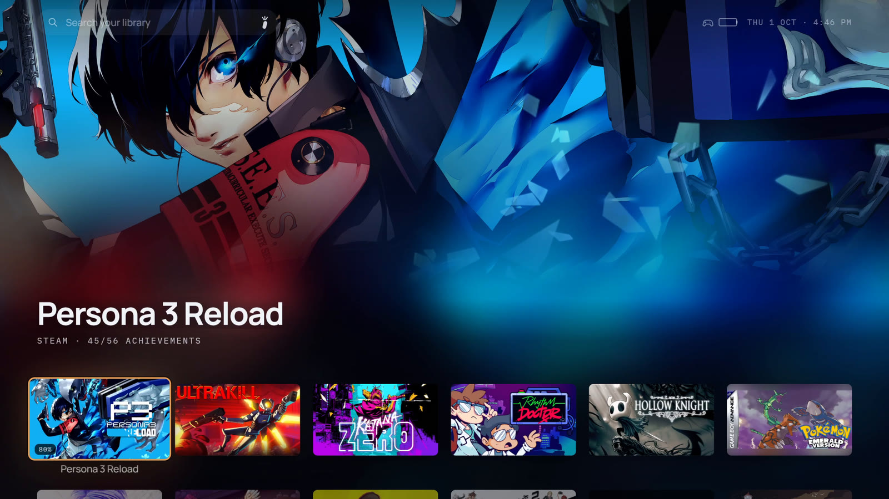

Loungepad is a full-screen launcher for a PC connected to a TV, by cable or streamed from another
room. It puts every game you own in one library and makes the controller a complete input device,
so you never walk to the desk for the mouse. And it's still a PC: emulators, mods and every Windows
app are a button away.

https://github.com/user-attachments/assets/0aa19943-f788-4f97-ac93-ffba33159b6f

## Every game you own, in one library

- **Steam, Epic, GOG, the Xbox app and PC Game Pass**, plus your emulators and ROMs, side by side.
  Installed games are found on their own, and the games you own but haven't installed can come in
  too, one press from installing.
- **Art, descriptions, ratings and trailers** are fetched for every game, with no setup.
- **Achievements and play stats.** Every session is recorded, with CPU and GPU readings.
- **Favorites, collections, filters and search**, and one button to hide anything that isn't a game.

<table>
  <tr>
    <td>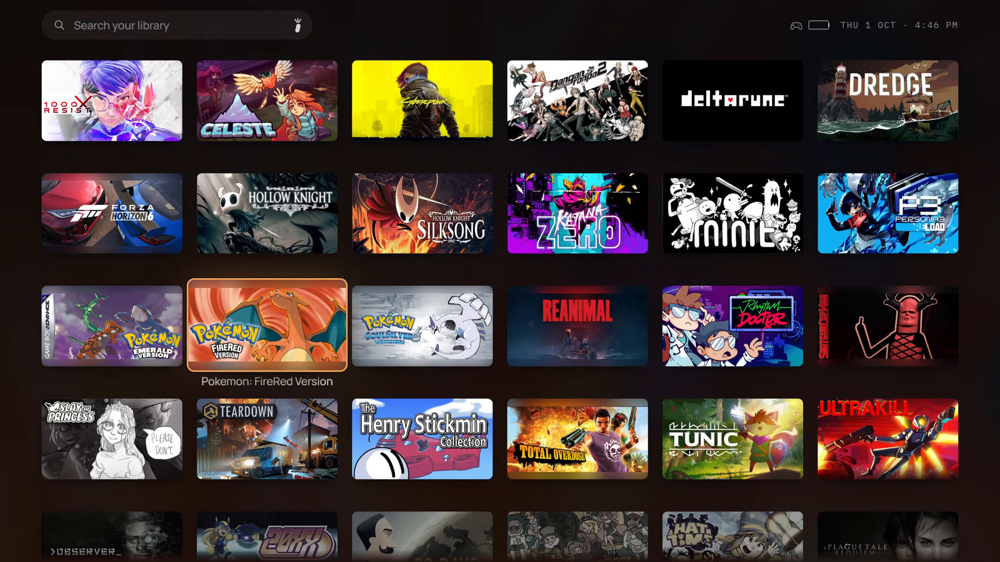</td>
    <td>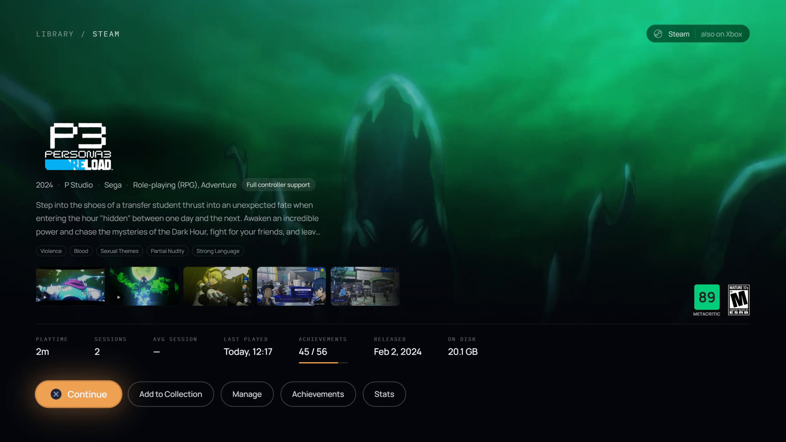</td>
  </tr>
  <tr>
    <td>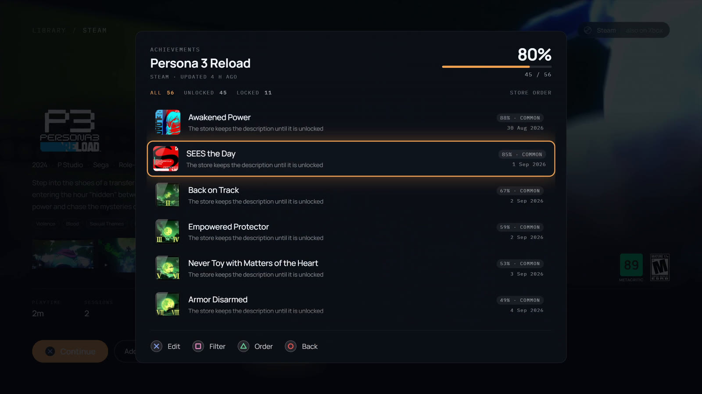</td>
    <td>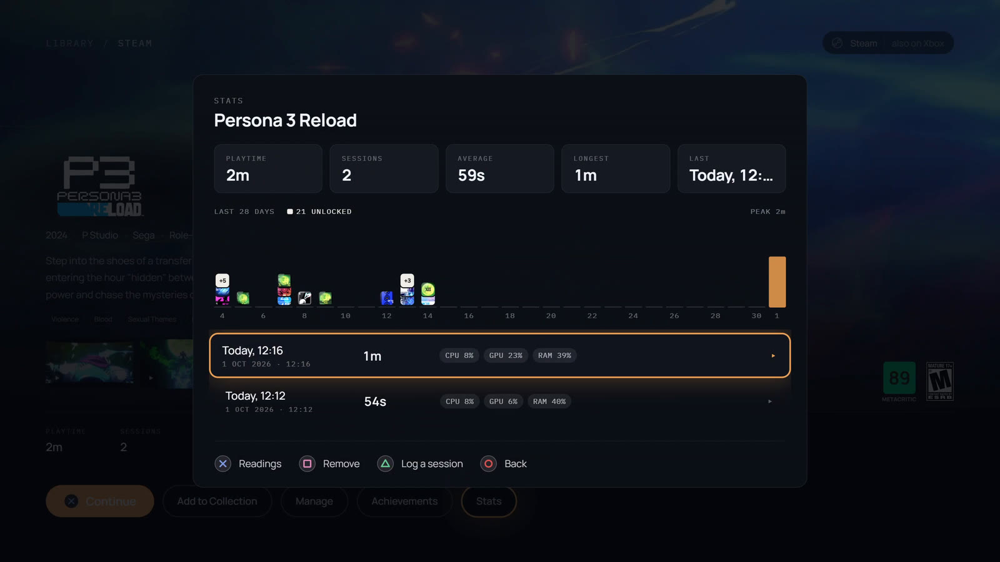</td>
  </tr>
</table>

## No keyboard. No mouse.

Most couch launchers stop once a game starts. Loungepad covers everything after it:

- **The left stick is the mouse**, the right stick scrolls, and A and B click, anywhere in Windows.
  A DualSense touchpad works like a laptop's.
- **The Power Wheel.** Tap the Xbox button (PS or Home on other pads) anywhere, even mid-game, to
  switch windows, close what's stuck, jump to File Explorer or Settings, or rest the TV. Hold it to
  bring Loungepad back.
- **App shortcuts on your controller**, ready for browsers, Spotify, VLC, Discord, File Explorer
  and more, or add your own. Pick one from the Power Wheel or give it a button.
- **An on-screen keyboard built for controllers.** View (Create on a DualSense) raises it anywhere
  in Windows, with word suggestions.
- **It rests like a console.** Put the controller down and the TV goes dark and the game pauses;
  any button brings both back.
- **Even admin prompts and the sign-in screen (beta).** Turn it on in Settings → Advanced and the
  controller works on UAC prompts and the lock screen too, so you can approve a prompt or sign in
  without leaving the couch. It's an optional signed service that Windows asks you to approve once
  ([how it works](docs/SECURE-INPUT.md)).

<table>
  <tr>
    <td>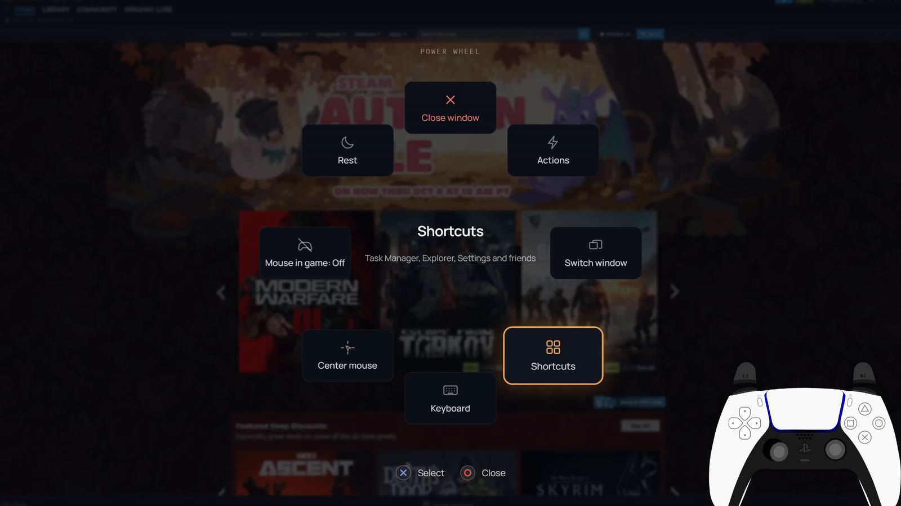</td>
    <td>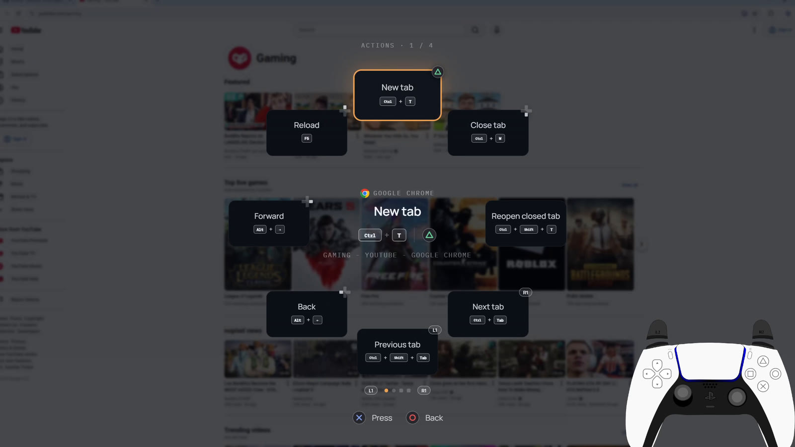</td>
  </tr>
  <tr>
    <td>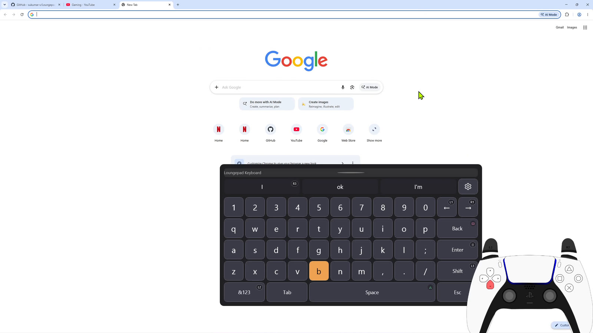</td>
    <td>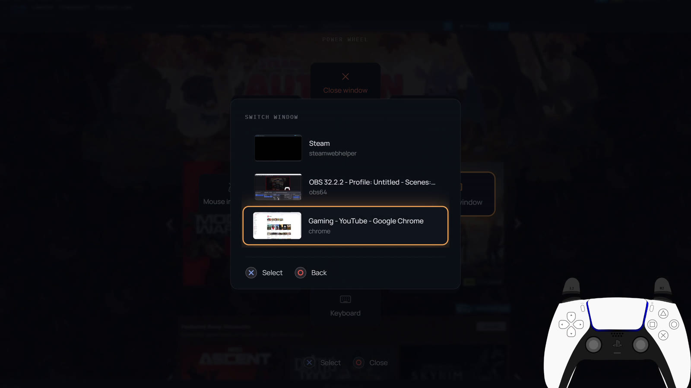</td>
  </tr>
</table>

Works with Xbox, PlayStation, Switch and other controllers. A keyboard and mouse work too.

## What a console can't do

- **Emulators and ROMs.** RetroArch, Dolphin, PCSX2, DuckStation and about twenty more are found
  automatically, with RetroArch's playlists and your ROM folders. ROMs get box art and sit in the
  library with everything else.
- **Mods.** Turn mods on and off, remove them and find new ones from the couch, through
  [Vortex](https://www.nexusmods.com/site/mods/1).
- **Themes.** Two built in, Loungepad and Shelf, with your choice of accent colour. Or
  [write your own](docs/THEMES.md) in CSS.
- **Add-ons.** Community themes and extensions, installed from Settings → Add-ons. The first
  extension is [HowLongToBeat](https://howlongtobeat.com): how long each game takes to beat, on
  its page. Extensions run in a sandbox that can reach only the hosts they declare;
  [write one](docs/ADDONS.md) in JavaScript, or add yours to the
  [add-ons repository](https://github.com/sukumar-v/loungepad-addons).

<table>
  <tr>
    <td>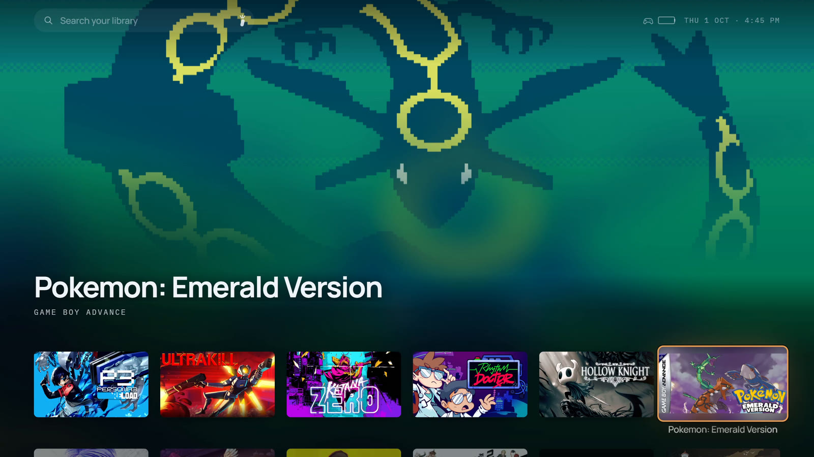</td>
    <td>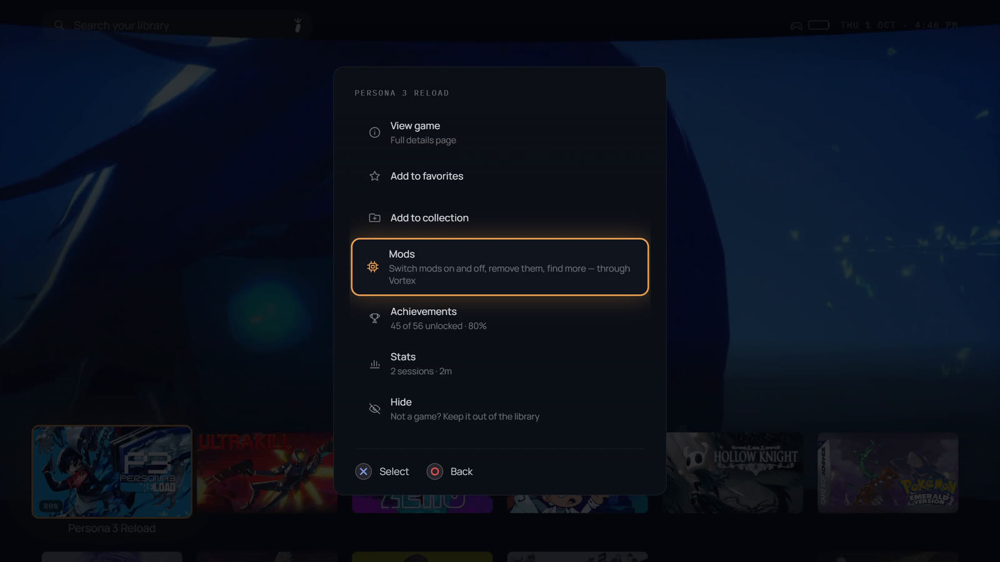</td>
  </tr>
</table>

## Install

1. **[Download `Loungepad.exe`](https://github.com/sukumar-v/Loungepad/releases/latest)** and move
   it somewhere it can stay under your user folder, such as a folder in Documents (not
   `Program Files`, so it can update itself).
2. Run it. Releases are code-signed, but SmartScreen can still warn about a new release until
   enough people have run it: if it does, choose **More info → Run anyway**.
3. A short setup, driven with the controller, asks which screen is the TV, signs in to your stores
   and picks the look. It finds your games while you answer.

It's one file, with nothing to unzip and nothing else to install: .NET is bundled, and Windows
already has the WebView2 runtime. Loungepad updates itself from this repository's releases.
Settings and the library live in `%APPDATA%\Loungepad`; to uninstall, delete `Loungepad.exe`.

## Controls

| Controller | Keyboard | On the library |
|---|---|---|
| A | Enter | Launch / select |
| B | Esc | Back |
| X | X | Filter and sort |
| Y | Ctrl | A game's options |
| View | `/` | Search, with the on-screen keyboard |
| Menu | Tab | Settings |
| LB | `` ` `` | Stats |
| Xbox button, tap | | Power Wheel |
| Xbox button, hold | | Show or minimize Loungepad; the in-game menu while a game runs |
| | H | Minimize Loungepad; click the tray icon to bring it back |

PlayStation and Switch pads use the buttons in the same places, and the hints on screen show them.

## Documentation

- **[User guide](docs/GUIDE.md):** every feature in detail, from store sign-ins to emulators,
  mods, and rest and sleep.
- **[Themes](docs/THEMES.md):** how to write your own.
- **[Add-ons](docs/ADDONS.md):** community themes and extensions, how to write an extension, and
  the repository they come from.
- **[Development](docs/DEVELOPMENT.md):** building, packaging and how it works inside.

## Questions, ideas and problems

- **[Tell us what to build next](https://loungepad.app/feedback):** a one-minute form. Rate
  Loungepad, tick the features you want most, and say anything else. No account needed.
- **[Discord](https://discord.gg/a6gngxS9b4):** get help, share your couch setup, and vote in
  polls.
- **[Discussions](https://github.com/sukumar-v/Loungepad/discussions):** ask a question, show off
  your setup, or post an idea. Upvote the ideas you want most.
- **[Report a problem](https://github.com/sukumar-v/Loungepad/issues/new/choose)** if something
  doesn't work the way it should.

## Want to leave a tip?

Loungepad is free, and it will stay free. If you'd like to say thanks, give to a good cause
instead: [GiveWell](https://www.givewell.org/charities/top-charities) recommends the charities
that do the most good for each dollar, and [Charity Navigator](https://www.charitynavigator.org/)
rates thousands more, whatever cause you care about.

## Build

Needs the **.NET 8 SDK** and the **WebView2 runtime** (Windows already has it).

```bash
dotnet build Loungepad.sln
```

Run `Loungepad\bin\Debug\net8.0-windows\Loungepad.exe`, with `--windowed` for a 1280×720 window.
Packaging a release is in [Development](docs/DEVELOPMENT.md).

## Contributing

Bug reports and small fixes are welcome; open an issue first for anything larger, and post feature
ideas in [Discussions](https://github.com/sukumar-v/Loungepad/discussions/categories/ideas).
Build steps, the conventions this repo follows, and what is deliberately out of scope are in
[CONTRIBUTING.md](CONTRIBUTING.md).

## License

Licensed under the [Apache License 2.0](LICENSE). See [NOTICE](NOTICE) for attribution and
third-party components.

"Loungepad" and the Loungepad logo are **not** covered by that grant — section 6 of the license
reserves trademarks. Fork it freely; give the fork its own name.
