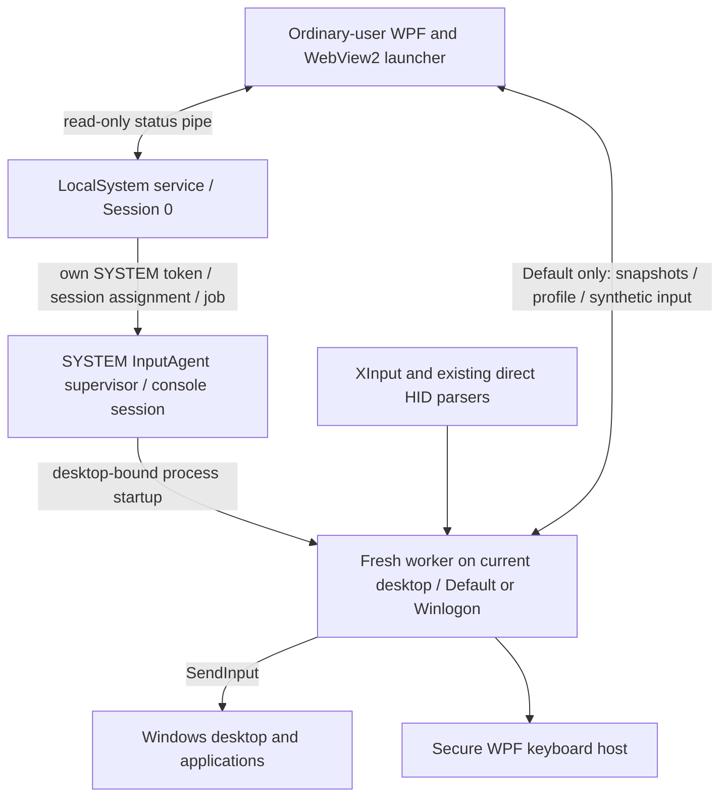

# Loungepad v1.8.0 input service handoff

Checkpoint: October 8, 2026. Read this together with `docs/SECURE-INPUT.md`.
This records the preceding development session; machine state and test results below are
last verified observations, not a guarantee that the same processes are still running.

## Start here

Workspace: `C:\Users\Sukumar\Projects\Windows\Loungepad`.
Branch: `secure-desktop-input`, off `main` at `75c1660`; the whole feature is committed there
(Oct 8, evening) and `main` has none of it. No PR, push, or public v1.8.0 release was made.

The user's physical result against the build of 17:26 (Oct 8, evening): stick mouse movement
**very jittery, slow on the main desktop and fast on admin prompts**. Both were diagnosed and
fixed in code -- see "Jittery stick" under the bugs below -- and the packages were rebuilt (see
"Latest local build"). The new service package still needs installing with UAC, and the fix then
needs the user's physical confirmation on both desktops with both pads. Do not infer success
from a running service, a heartbeat or a suppression counter.

The user wants the joystick to move **only the mouse**, and A/Cross to **only click**
when using mouse mode. An earlier phrase about treating the joystick as Tab was a
misstatement that the user explicitly corrected. Test wired DualSense and Xbox via
wireless adapter. Steam was running in earlier reports, but was not running during
the latest duplicate-navigation investigation.

## Requested behavior

- Optional controller mouse and keyboard on elevated apps, Task Manager, UAC, and
  Windows lock/sign-in, covering existing supported controllers.
- The launcher remains an ordinary-user WPF/WebView2 application.
- Use the keyboard selected in Loungepad settings; default is the Loungepad keyboard.
- General settings can install/enable, disable without uninstalling, and separately
  uninstall the input service. Installation requires an app confirmation and Windows UAC.
- Signed v1.8.0 packages, with existing launcher auto-update behavior preserved.

## Architecture and input ownership



`Loungepad.Service` uses the standard `ServiceBase` Windows service model and runs as
LocalSystem. It watches `WTSGetActiveConsoleSessionId` every 500 ms. Session 0 never
directly injects into the interactive desktop. `SessionProcess.cs` duplicates the
service's own SYSTEM token, enables the necessary privilege, assigns `TokenSessionId`
and `TokenUIAccess`, and uses `CreateProcessAsUser` to start the agent supervisor in
the console session. A kill-on-close job owns the supervisor and worker descendants.
Stop, disable, service failure, or console-session replacement cleans up that tree.

`Loungepad.InputAgent` is signed and has `uiAccess=true`. Its supervisor follows
`OpenInputDesktop`. Each desktop gets a **fresh worker process**, bound through
`STARTUPINFO.lpDesktop` before CLR/COM/STA initialization. The worker verifies its
startup desktop using `GetThreadDesktop`. Do not reintroduce `SetThreadDesktop` after
STA initialization: it reproducibly failed with Win32 error 170.

| State | Capture and mapping owner |
| --- | --- |
| Service unavailable or disabled | Existing local launcher capture and mapping |
| Default desktop, launcher connected | Worker captures controller snapshots; launcher `GamepadService` retains focus/game/overlay policy, buttons, keyboard, combos, bindings and the touchpad, and sends that native input through the authenticated pipe for the worker to inject. **The pointer and the wheel are moved by the worker itself**, in its own 8 ms loop from its own reading, as the request's per-tick policy (`MovePointer`, `ScrollWheel`) allows; the reply's `PointerOwner` says it does, and an older worker without it leaves the launcher moving the pointer through the pipe as before |
| Default desktop, launcher absent or unresponsive for 250 ms | Worker `SecureMapper` maps physical input autonomously |
| Winlogon desktop | Worker maps physical input autonomously; no ordinary-user input pipe exists on this desktop |

Transitions release held synthetic buttons/keys, hide the keyboard, and require a
neutral controller before accepting input again. XInput checks four slots. Existing
Sony, Switch, and generic HID parsers are reused with direct HID reads and one-second
device discovery. Quiet reads avoid Raw Input registrations keeping the display awake.

Important limitation: with the launcher closed, autonomous Default-desktop mouse
mapping also applies over games. Existing launcher focus/game policy is available
only while the launcher participates.

## Projects and principal files

| Location | Responsibility |
| --- | --- |
| `Loungepad.Input/Protocol.cs` | Versioned bounded JSON framing, DTOs, native-event validation |
| `Loungepad.Input/InputProfile.cs` | Validated mappings/preferences and machine profile |
| `Loungepad.Input/NeutralInputGate.cs` | Neutral handoffs |
| `Loungepad.Input/InputCadence.cs` | Process-local high-resolution 8 ms scheduling |
| `Loungepad.Service/` | Windows service, status, session token/process/job management |
| `Loungepad.InputAgent/Program.cs` | Supervisor and desktop worker startup |
| `Loungepad.InputAgent/DesktopWorker.cs` | Controller polling, pipe ownership, desktop worker health |
| `Loungepad.InputAgent/SecureMapper.cs` | Autonomous mouse/keyboard mapping |
| `Loungepad.InputAgent/InputInjector.cs` | SendInput, held-input tracking, cleanup, error reporting |
| `Loungepad.InputAgent/GamepadNavigationFilter.cs` | Narrow per-desktop Windows gamepad virtual-key filter |
| `Loungepad/Services/ServiceInputClient.cs` | Authenticated UI IPC, snapshots, queued events/profile sync |
| `Loungepad/Services/GamepadService.cs` | Existing policy adapted to remote snapshots/local fallback |
| `Loungepad/Services/InputServiceSetup.cs` | Elevated setup coordination |
| `Loungepad/Services/InputServicePackage.cs` | Release download and package validation |
| `Loungepad/UiBridge.cs`, `Loungepad/ui/app.js` | General settings flows and status |
| `Loungepad/KeyboardWindow.xaml.cs` | Secure-mode keyboard behavior reused by privileged host |
| `tools/*input-service.ps1` | Service packaging, installation, uninstallation |
| `tests/Loungepad.Input.Tests/`, `tests/input-service-ui.test.cjs` | Checks and optional live probes |

The shared library links existing native/HID source; the UI excludes duplicate
compilation and references the library. MainWindow coordinates input ownership.
The main UI remains `uiAccess=false`; WebView2 never runs as SYSTEM.

## IPC, keyboard, and privilege boundary

- Status pipe: `Loungepad.Service.Status.v1`, read-only.
- Default input pipe: `Loungepad.Input.v1.<session>`. ACL permits SYSTEM and the console
  user, denies network clients, checks client PID/session and impersonated SID.
  The launcher checks that the server pipe owner is SYSTEM.
- Frames are limited to 32 KiB, batches to 128 events, and the pending queue to 64 batches.
- Profiles contain validated preferences, not arbitrary commands, executable paths, or URLs.
- HKLM `SOFTWARE\Loungepad\Input` stores machine enable state, last console profile,
  and aggregate diagnostics. Pre-login uses the last profile; the logged-in launcher
  syncs that user's preferences afterward.
- Secure keyboard reuses the Loungepad WPF layout/controller controls, with prediction,
  typed-text history, and punctuation transformation disabled. Exact selected characters
  are injected locally. Passwords/text are not logged, persisted, or relayed over IPC.
- OSK and TabTip use fixed Windows paths; their broker/desktop behavior needs separate
  verification. The built-in keyboard is the default and primary path.
- No credential provider, automatic login, secure-attention synthesis, UAC policy
  weakening, ViGEmBus dependency, RDP support, or preboot/BitLocker support was added.

## Bugs diagnosed and fixes already made

### Service running but no useful worker

`CreateProcessAsUser` failed with error **740** because the token did not match the
agent's UIAccess manifest. Explicit `TokenUIAccess` on the service's own duplicated
token fixed startup. Do not solve this by removing signing checks or elevating the main UI.

### Blinking loading cursor and repeated worker restart

`SetThreadDesktop` after .NET STA initialization failed with **170 / ERROR_BUSY**,
confirmed with a separate reproduction. Startup desktop binding replaced that call.
Both launch paths use `STARTF_FORCEOFFFEEDBACK`; failures back off from two to thirty
seconds and reset on desktop change. Worker heartbeat and native errors are now exposed.
Failed/partial SendInput is reported instead of silently ignored.

### Stuttering mouse movement

Read-only measurements found controller reads around 0.01 ms and device discovery
around 0.02 ms. `Thread.Sleep(8)` and `Task.Delay(8)` actually scheduled around **15.6 ms**.
The new `InputCadence` uses a high-resolution waitable timer and absolute Stopwatch
deadlines, skips missed frames, and avoids busy spinning/global timer-resolution changes.
It drives UI polling, IPC polling, and a dedicated agent pump that posts/awaits one STA
dispatcher tick at a time. Queued native events immediately wake IPC via AutoResetEvent.

Measured new cadence: **8.00 ms mean**, approximately **8.26–8.28 ms p95** and
**8.5–8.7 ms maximum**. This measures scheduling, not the complete perceived experience.
Another problem was `Environment.TickCount64`: **49/100** movement ticks had zero
elapsed time at 125 Hz. Autonomous movement now receives Stopwatch-derived milliseconds;
coarse ticks remain for housekeeping/health timeouts.

### Windows highlight movement and duplicate A/Cross actions

The documented `ControllerToVKMapping\Enabled=0` registry workaround was tried and
the user confirmed it did **not** work. The prior state was restored: `Enabled` was
originally absent and is absent again. Backup: `artifacts/windows-controller-navigation-before.json`.
An empty registry key may remain, but there is no effective override.

The current implementation installs a per-worker **WH_KEYBOARD_LL** hook on its desktop.
It suppresses only **VK_GAMEPAD_* (0xC3–0xDA)** while the profile's mouse mapping is
enabled. Ordinary Tab, Enter, arrows, letters, and credential characters pass through.
It does not disable controller drivers, GameInput, or physical XInput/HID readings.
Health exposes only the aggregate `SuppressedNavigationEvents` count.

**The hook is on a thread of its own now** (Oct 8, evening), one that only pumps messages
for it. It used to run on the worker's STA dispatcher, the thread that also shows the secure
keyboard (a WPF window, whose first show is easily longer than `LowLevelHooksTimeout`), and
Windows skips a hook whose thread does not answer in time and documents that it may then
remove it silently. Measured with the new `--navigation-hook-stall-probe` on 26200: a plain
hook on a thread blocked for 1.5 s survived, but missed the keys sent during the stall, which
Windows navigation would then have acted on; the filter on its own thread caught 6 of 6.

The installed worker's hook was checked live without a pad (worker 131320, Default): one
injected `VK_GAMEPAD_RIGHT_THUMBSTICK_LEFT` tap from an ordinary process moved the counter
from 0 to 2 within one heartbeat. That proves the hook is alive and drops injected gamepad
virtual keys on that desktop; it does not prove where Windows' own controller navigation
events travel on every screen. XInputUWPFix's README says it is exactly this -- a low-level
keyboard hook filtering 0xC3–0xDA -- and it exists to stop UWP apps acting on them, which is
the evidence that those events do pass through the hook chain. XInputUWPFix was **not
installed** and no source file was copied. There is no separate filter setting; its
lifetime follows the worker and mouse mode. Actual final behavior still needs user
confirmation, and compatibility with Windows/UWP game UIs that depend on these virtual keys
while mouse mode is on is still unreviewed.

### Jittery stick, slow on the desktop and fast on admin prompts (Oct 8, evening)

The user's result against the 17:26 build. Two causes, both in code, neither in the timer:

- **Two formulas.** `GamepadService` (Default with the launcher connected) curved the
  stick's deflection and moved along its direction; `SecureMapper` (Winlogon, and Default
  with no launcher) curved each axis on its own, which is up to 41% faster on a diagonal.
  Same 1400 px/s base, same profile, different motion. DPI was ruled out first: both
  manifests are PerMonitorV2 and the display is 2560x1440 at 100%.
- **A stale base on the pipe path.** On Default every move was `GetCursorPos` + dx, sent
  through the pipe as an absolute target. A tick that read the pointer before the previous
  move had been injected aimed from the old place and threw that move away: motion was lost
  for exactly as long as a round trip took -- "slow and uneven" on the one desktop that used
  the pipe, full speed on the one that did not.

Now `Loungepad/Services/StickPointer.cs` (compiled into both the launcher and
Loungepad.Input) is the one formula, and **the agent moves the pointer on every desktop**.
Each request carries the launcher's policy for the tick (`AgentRequest.MovePointer` and
`ScrollWheel`, set by `ServiceInputClient.SetPointerPolicy` from the mouse branch and read
as off once 50 ms old, so every path that leaves the branch stops the agent without naming
it); the worker's `Tick` in connected mode calls `SecureMapper.MovePointer` with a fresh
capture, leaving the touch travel in the reader for the next reply. Buttons, keyboard,
combos, bindings and the touchpad stay the launcher's. The reply carries `PointerOwner`, so
an older agent (no such field) leaves the launcher moving the pointer through the pipe as
before -- now through `NativeMethods.MoveCursorBy`, which aims from where the last move was
heading while the pointer still sits where it was seen before that move went out (the
touchpad's `TouchpadGestures.MoveCursor` goes through it too, since it still crosses the
pipe), with the aim kept inside the virtual screen so a push against an edge cannot run it
off. The wheel is whole notches with the axis pushed further winning, on both sides; dt is
the Stopwatch on both sides (`GamepadService` read whole milliseconds, 8 or 9, before).
The settings row says "the installed service is older than this Loungepad" while a
connected agent does not claim the pointer.

Checked by 13 new default checks: the formula (full deflection, diagonal, deadzone on the
deflection, boost), the mover (a second of 8 ms ticks travels 1400 px, a slow push adds
up, a release drops the fraction), the pointer-only mapping (moves and scrolls in whole
notches, leaves a held click button alone, holds still when the policy says so), the
older-peer compatibility of both records, and the in-flight guard. Not yet checked: the
user's hands, on either desktop.

### Still jittery with the agent moving the pointer: one DualSense read as two pads (Oct 8, 19:00)

The user installed the pointer-fix service (agent `B0336553…`, worker 136712) and reported the
stick still jittery on both desktops, a little better on the prompt screen. With both desktops on
the same code now, the probes looked at what feeds it:

- `--dispatcher-cadence-probe` (the worker's tick mechanism reproduced: a precise 8 ms timer
  posting one tick at a time to an STA dispatcher, each tick reading the pointer and opening the
  input desktop): 500 ticks, mean 8.00 ms, sd 0.19, max 8.52, none over 10 ms, at Input, Normal
  and Send priority alike. The tick is not the jitter.
- `--hid-probe` (a reader of our own over the real devices, 3 s of snapshots at 1 ms): **two pad
  instances for the one DualSense** -- the Bluetooth interface (`HID\{00001124-…}_VID&0002054C…`,
  ~380 reports/s) and the USB one (`HID\VID_054C&PID_0CE6&MI_03…`, ~150/s), both reading the
  same stick -- and **the "last pad to report" changed 653 times in 3 s**. The pad is on the
  cable and still paired, and Windows lists both (the PnP list shows both HID game controllers
  present). `HidGamepadReader.Snapshot` returns whichever instance reported last, so the agent's
  stick reading alternated, a few hundred times a second, between the cable's copy and the
  radio's, which lags it: every push read as a sawtooth. The launcher's log had shown it since
  18:24 (`reading full reports (id 0x31 …)` and `(id 0x01 …)` for the same pad, one line each).

Fix: one reading per physical pad (`HidGamepadReader.Reconcile`). A Bluetooth instance is
`Shadowed` while a wired instance of the same pad is present -- same vendor and product, and not
two different serials (`HidPad.SamePhysicalPad`; a serial is compared by its hex digits, a
missing one cannot say they differ) -- and takes over the moment the cable goes. A shadowed
instance's reports keep its state current and nothing else: never the reading, never touch
travel (its accumulators are dropped on either change, or they would land as one jump). The
reader lists its instances for diagnostics (`Describe`, printed by the probe). This is in the
shared reader, so the launcher's local path and both the agent's paths get it; both packages
were rebuilt. Checked with the probe over the real devices after the change: the Bluetooth
instance SHADOWED, the reading from the cable alone at ~250 reports/s, the last reporter changed
0 times in 3 s. The USB interface reports no serial and the Bluetooth one reports the pad's
address (`0c27565b1c5b`), so it is the "a missing serial cannot say they differ" rule that
matches them on this pad. Not yet confirmed by hand.

In the same pass, `SecureMapper.SelectPad` now decides which pad is driving the way the launcher
does -- movement against an anchor past the sticks' noise (`StickPointer.Moved`, 1600 counts,
shared with `GamepadService`) -- instead of comparing raw readings, which would have let a
resting Xbox pad's wobble take the mapping from the DualSense in hand a few times a second once
both are connected, which the next test does. On a simultaneous change the pad in hand keeps
the pointer, as in the launcher. Two checks cover it (68 → 70).

### Installer reset machine preferences during upgrade

PowerShell `New-Item -Force` against an existing registry key cleared its values,
reproduced in a disposable HKCU key. The installer now uses
`Registry.LocalMachine.CreateSubKey('SOFTWARE\Loungepad\Input')` and disposes it.
A separate test confirmed existing Enabled/Profile survive. The final signed launcher
also embeds this fixed installer. Final installation restored a whitelisted profile
from normal user settings and re-enabled the feature.

## Installation, signing, and updates

SCM name: **Loungepad.Service**, automatic start, LocalSystem.
Protected installation root: `C:\Program Files\Loungepad\Input`.
The agent has its own `Agent` runtime subdirectory to avoid assembly collisions.
Protected staging, signature/catalog validation, admin ACLs, and installation backups
are implemented. Uninstall removes the service, protected files/backups, and machine
input settings while retaining the ordinary launcher/preferences.

General settings offers confirmation before missing-service download/install. Disable
retains the installation; uninstall is separately offered only while installed.
The elevated installer is embedded in the signed launcher and invoked through encoded
PowerShell, so normal users do not have to run a downloaded script. Windows UAC approval
is still required. An unsigned debug launcher cannot authenticate automatic installation.

For manual installation only, use process-scoped execution policy bypass:

```powershell
powershell.exe -NoProfile -ExecutionPolicy Bypass -File .\install-input-service.ps1 -SourcePath .
```

Run from the intended verified package with administrator approval. Do not change the
machine execution policy. Manual installation defaults to disabled; `-EnableProfile`
is supported. Existing installation updates now preserve the profile and enable flag.

Downloads pin the matching version/tag/asset and SHA-256, and enforce download/extraction
bounds (256 MiB archive, 768 MiB expanded, 128 MiB per file, 4096 files). Extraction rejects
traversal, alternate streams/device paths, links, and duplicates. Executable signatures
and the package catalog must be trusted and match the signed launcher's publisher.

Signing uses existing ignored `tools/signing.json` and ArtifactSigning/Azure configuration.
Do not print or copy its contents into handoff/release notes. Run signing builds sequentially;
they share SDK/runtime metadata. Do not edit package files after signing the catalog.

Release assets are deliberately distinct:

- `Loungepad.exe`
- `Loungepad-v1.8.0-win-x64.zip` (existing launcher updater)
- `Loungepad.InputService-v1.8.0-x64.zip` (service; deliberately lacks `-win-x64.zip`)

The old launcher updater selects assets by suffix. Preserve this separation. Launcher
auto-update remains available; privileged service updates still require the separately
elevated signed installer. Fully automatic service updating is **not implemented**.
In-app first-time installation requires matching published release assets. We have not
published v1.8.0, so local successful installation does not prove that public flow works.

## Latest local build and installed checkpoint

These are historical checkpoint paths, not a reason to reinstall without investigation.
Older GUID build directories and extracted service folders can be stale.

| Item | Path relative to workspace |
| --- | --- |
| Signed launcher (one pad per controller, Oct 8 19:30) | `dist\v1.8.0\Loungepad.exe` |
| Launcher ZIP | `dist\v1.8.0\Loungepad-v1.8.0-win-x64.zip` |
| Service ZIP (one pad per controller, Oct 8 19:30) | `dist\Loungepad.InputService-v1.8.0-x64.zip` |
| Latest signed service package source | `artifacts\input-service\d1a072bfa11c4c049bd4d6b527d7183f\package` |
| Build logs | `artifacts\input-service-onepad-*-build.log`, `artifacts\launcher-onepad-*-build.log` |
| Pointer-fix service package (18:20), **installed as of this writing** | `artifacts\input-service\ae79aa8ac9fd4caf98710160132e5b8b\package` (agent `B0336553…`) |
| 17:26 service package, the one before | `artifacts\input-service\a104da0444294117b6ba5555dcf4dfde\package` (agent `83504FAD…`) |

Latest service ZIP SHA-256: `BAC537D513B8544DA2ADC0FEFFD9C4978FE43C9975D4FE0B277E9BEAAEC4229F`;
its agent exe `E5FD64A2A0ACEEDC958D8141A4497142DA93F402E41D2029BB6E8F6E4576D0EA`. Every binary
and the catalog verified: signature Valid with a timestamp, `Test-FileCatalog` Valid. All three
agents report file version 1.8.0.0, so the hash is how to tell them apart.
Latest launcher SHA-256: `3230426EBA15F8E10ED205AC41914C8EBBBFAC9B00D8BEB71723CA2B41957A64`;
launcher ZIP `0FFDCDFD13AF8E03059AD0DAFC77D491AC1A4C8DE91637596EA750FE754A7C8C`; signature Valid
with a timestamp, file version 1.8.0.0, 29 shipped files embedded. (The 18:20 launcher was
`5FBFA8FD…`, the 17:26 one `E706A173…`.)

**Installed as of this writing: the 18:20 service (agent `B0336553…`)**, which the user installed
with UAC after cancelling one prompt at 18:26 (while that prompt was up the old service put a
fresh worker on Winlogon, pid 129840, controller present, ready, no error, and came back to
Default when it closed). The one-pad-per-controller package is NOT installed yet. No launcher
was running at 19:00 (the 18:24 one, pid 136372, is gone without a log line; the user closed it
or it was closed for the install). To install the latest, in an administrator PowerShell:

```powershell
cd 'C:\Users\Sukumar\Projects\Windows\Loungepad\artifacts\input-service\d1a072bfa11c4c049bd4d6b527d7183f\package'
powershell.exe -NoProfile -ExecutionPolicy Bypass -File .\install-input-service.ps1 -SourcePath .
```

It keeps the enabled flag and the profile. Then start `dist\v1.8.0\Loungepad.exe`; it reconnects
on its own and the settings row must not say the service is older.

Host is Windows 11 25H2 **26200.9457**. Rediscover process IDs; never reuse old IDs/HWNDs.

## Validation already performed and its limits

- Solution build succeeded. Existing ModService nullable warnings and offline NU1900
  vulnerability-metadata warnings remained; no new build error.
- **64 default C# checks passed** (Oct 8, evening; 51 before the pointer work): protocol/profile
  validation, pipe owner spoof rejection, mappings, neutral transitions, exact secure keyboard
  behavior, download/ZIP checks, filter boundaries and ordinary-key preservation, and the 13
  pointer checks listed under "Jittery stick". Default tests do not inject real keys.
- `--navigation-hook-stall-probe` (Oct 8, evening): the dedicated-thread filter suppressed
  6 of 6 injected gamepad virtual keys across a 1.5 s stall of the dispatcher thread; a plain
  hook on the stalled thread saw 2 before the stall and 2 of the 4 sent during and after it.
  The installed worker's own counter went 2 → 6 over that probe: the keys the plain hook
  passed on before and after its stall reached the worker's hook (installed earlier, so later
  in the chain), the two sent during the stall reached no hook at all. A stalled hook thread
  therefore hands the key straight to the application, which is the duplicate activation.
- The installed worker's hook, live: counter 0 → 2 on one injected tap (see above).
- `--service-mouse-probe` (Oct 8, 18:24, launcher closed, against the installed 17:26 worker):
  authenticated pipe, HID present, real pointer moved and restored, worker stable. Passed.
- The new launcher started from `dist\v1.8.0` at 18:24 logged `Loungepad 1.8.0 starting`, both
  DualSense HID entries (USB report 0x01 and Bluetooth 0x31: the pad is on the cable and still
  paired) and the Steam library, and the worker went back to `launcher connected`. Unexplained:
  the 17:35 instance of the previous build (pid 119300) ran for an hour without writing one line
  to `%APPDATA%\Loungepad\loungepad.log`, which was not locked and had last been written by the
  1.7.2 launcher at 10:53. Not reproduced; worth a look if a launcher ever goes quiet again.
- Machine facts read on Oct 8, evening: Game Bar's button and chord off, Xbox mode off
  (`GamingHomeApp` empty), `ControllerToVKMapping\Enabled` absent, no `LowLevelHooksTimeout`
  set for any user, Steam not running, DualSense present on USB (and paired over Bluetooth),
  Xbox pad paired over Bluetooth LE and **not** connected to XInput (all four slots empty)
  although the Xbox Wireless Adapter is attached, so the worker's "controller present" was
  the DualSense alone.
- Two desktop probe checks passed: correct STA startup desktop accepted, wrong one rejected.
- Navigation hook probe installed/forwarded/unhooked with filtering disabled. This proves
  hook setup, not final suppression on every Windows screen.
- Timing probe produced the cadence measurements above. Its comparison temporarily calls
  timeBeginPeriod in the test process and restores it; production does not use that strategy.
- Final installed-service Task Manager probe authenticated the SYSTEM pipe, required neutral
  input, moved the real pointer 12 pixels and restored it, injected no clicks/keys, verified
  foreground Taskmgr, and observed the same healthy worker for six seconds afterward. Passed.
- Earlier UAC transition observed Default → Winlogon (ready/controller present/no error)
  → Default. This preceded the final filter/timing update and is not final UAC validation.
- Node UI checks passed; `git diff --check` was clean apart from line-ending notices.

An attempted temporary live navigation observer was **inconclusive** (observed zero events;
hook ordering/privilege assumptions were unproven). It was removed. Do not cite it as a
passing end-to-end test or assume observer ordering relative to the SYSTEM hook.

## How to continue

1. Install the new service package (administrator PowerShell in the package folder named
   under "Latest local build": `.\install-input-service.ps1 -SourcePath .`; it keeps the
   enabled flag and profile) and run the new `dist\v1.8.0\Loungepad.exe`. The settings row
   must no longer say the installed service is older. Until the service is updated the new
   launcher moves the pointer through the pipe as before (with the in-flight guard), and the
   old launcher with the new service gets the old behaviour too: nothing is dead and nothing
   doubles, whichever is updated first.
2. Then the user's physical results: smooth motion at the same speed on the desktop, in Task
   Manager, over UAC and on the sign-in screen, no extra highlight movement and no double
   A/Cross, with the wired DualSense and the Xbox pad on the wireless adapter (power the pad
   on against the adapter; it was paired over Bluetooth LE and absent from XInput), and the
   built-in secure keyboard separately. Correlate each reproduction with desktop, worker
   identity, mode, ControllerPresent, Ready, LastError and SuppressedNavigationEvents. Never
   record credentials or raw typed keys.
3. If jitter persists on Default with both sides updated, it is no longer the pipe: the
   movement is the worker's own 8 ms tick. Measure that tick and its capture, check which pad
   `SelectPad` is following (a second pad resting on the desk can take over on a stick
   wobble), and that `MovePointer` is being asked for (the policy goes stale after 50 ms if
   the launcher's loop stalls). Do not substitute sensitivity changes for diagnosis.
4. If duplicate focus persists, check whether the counter increments during the actual
   failing interaction on that desktop. Investigate hook lifetime/timeouts, alternative
   Windows navigation paths, and other mappers. Do not broadly block Tab/Enter/arrows or
   disable GameInput/controller drivers.
5. Validate ordinary game input and UWP/game UI compatibility, especially while mouse mode
   and the filter are active. Review the launcher-closed autonomous mapping limitation.
6. Validate keyboard symbols/punctuation/exact text, secure history suppression, configured
   keyboard selection, OSK/TabTip limitations, and held-input cleanup without logging text.
7. Exercise reboot/pre-login, hotplug, fast user switching, held controls at desktop changes,
   disable/re-enable, stop/crash recovery, standard-user install confirmation, uninstall,
   and upgrade profile preservation.
8. Only after those checks assess release readiness, publish appropriate matching assets
   when authorized, and verify the real in-app download flow. Service update automation
   remains separate work; do not claim launcher updates update the service automatically.

Useful commands from the workspace:

```powershell
dotnet build Loungepad.sln --no-restore --nologo -v minimal -m:1 -nr:false -p:UseSharedCompilation=false
dotnet run --project tests/Loungepad.Input.Tests --no-restore
dotnet run --project tests/Loungepad.Input.Tests --no-build -- --desktop-probe
dotnet run --project tests/Loungepad.Input.Tests --no-build -- --navigation-hook-probe
dotnet run --project tests/Loungepad.Input.Tests --no-build -- --navigation-hook-stall-probe   # injects an inert gamepad key
dotnet run --project tests/Loungepad.Input.Tests --no-build -- --input-timing-probe
node --test tests/input-service-ui.test.cjs
```

Live mouse probe: close the launcher first (the pipe permits a single connection), leave
the controller neutral, and remember that this moves the real pointer:

```powershell
dotnet run --project tests/Loungepad.Input.Tests --no-build -- --service-mouse-probe Taskmgr
```

Minimal diagnostics (process/service visibility may need an elevated diagnostic shell):

```powershell
Get-ItemProperty 'HKLM:\SOFTWARE\Loungepad\Input' |
    Select-Object Enabled,LastError,AgentHealth | Format-List
Get-CimInstance Win32_Process -Filter "Name = 'Loungepad.Service.exe' OR Name = 'Loungepad.InputAgent.exe' OR Name = 'Loungepad.exe'" |
    Select-Object Name,ProcessId,ParentProcessId,SessionId,CreationDate | Format-Table
```

When changed code needs packaging, close the dist launcher first and run sequentially:

```powershell
./tools/package-input-service.ps1 -Version 1.8.0 -NoRestore
./tools/package.ps1 -Version 1.8.0 -NoRestore
```

A hidden launcher may not respond to Process.CloseMainWindow. Prefer its tray Exit.
Previously, enumerating windows for a verified executable/PID and sending WM_CLOSE to
its exact Loungepad main window worked. Do not blindly kill processes or reuse old HWNDs.
Tool sandbox escalation does not necessarily grant a Windows administrator token.
An installer helper may need `Start-Process -Verb RunAs -WindowStyle Hidden`; the user
must accept Windows UAC. Never assume that approval happened from elapsed time.

## References used during investigation

- [CreateProcessAsUser](https://learn.microsoft.com/en-us/windows/win32/api/processthreadsapi/nf-processthreadsapi-createprocessasuserw)
- [SetThreadDesktop constraints](https://learn.microsoft.com/en-us/windows/win32/api/winuser/nf-winuser-setthreaddesktop)
- [UIAccess security](https://learn.microsoft.com/en-us/windows/win32/winauto/uiauto-securityoverview)
- [High-resolution waitable timers](https://learn.microsoft.com/windows/win32/api/synchapi/nf-synchapi-createwaitabletimerexw)
- [LowLevelKeyboardProc and timeout behavior](https://learn.microsoft.com/en-us/windows/win32/winmsg/lowlevelkeyboardproc)
- [Controller mapping registry regression discussion](https://github.com/microsoft/microsoft-ui-xaml/issues/10035)
- [Original Windows controller navigation discussion](https://github.com/microsoft/microsoft-ui-xaml/issues/1495)
- [XInputUWPFix reference](https://github.com/BlueAmulet/XInputUWPFix)
- [JoyXoff](https://joyxoff.com/en/) was the user's functional comparison; do not infer its internal architecture from its public feature list.
