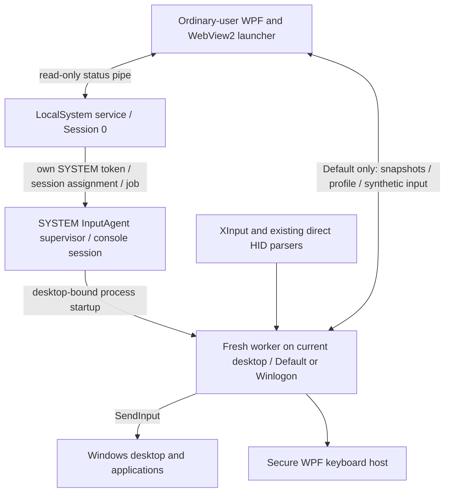

# Loungepad v1.8.0 input service handoff

## Follow-up: independent beta settings

The latest source moves secure input into the final **Advanced** settings category under
**Secure desktop input (beta)**, with separate UAC and sign-in toggles. `InputFeatures.cs`
stores administrator-controlled `UacEnabled`/`SignInEnabled` alongside the legacy master
`Enabled`; missing switches inherit the old combined state. The new service CLI is
`--configure <0|1 UAC> <0|1 sign-in> <base64 profile>`; old `--enable`/`--disable` still set both.
Default workers remain available while either option is enabled, preserving normal input
and profile sync even with UAC off. On Winlogon, the supervisor uses WTS username and
session lock state to distinguish unlocked-user UAC from locked/pre-login sign-in. Unknown
state requires both flags. These changes require a matching service update.

Uninstall also removes exact XInputUWPFix startup entries for the originating user and
machine, stops its helper processes, and removes identified executable/companion batch
files without deleting the surrounding directory. It clears the legacy navigation-disable
override if present. The installer is still embedded in the launcher, so changing these
scripts requires rebuilding the launcher as well as the service package. PIN onboarding
now mentions the experimental option and its Advanced settings location.

New checks: independent desktop-policy/migration cases in the C# suite, independent UI
toggle/confirmation/onboarding cases in the Node suite, and
`powershell.exe -NoProfile -ExecutionPolicy Bypass -File tests/input-service-uninstall.test.ps1`.
The latter uses fake registry/process objects and disposable files; it does not uninstall
the real service. Historical build paths/results below predate this follow-up.

Follow-up build checkpoint: signed launcher at `dist\v1.8.0\Loungepad.exe`, signed
service ZIP at `dist\Loungepad.InputService-v1.8.0-x64.zip`, extracted signed service
package at `artifacts\input-service\4b6fe9856bcd4a0abacf4a8d2adde6a1\package`.
Logs: `artifacts\launcher-advanced-build.log`, `artifacts\input-service-advanced-build.log`.
Both signature checks and the service file catalog passed. All 78 C# checks, three
desktop/session probe checks, Node UI checks, and isolated PowerShell cleanup checks passed.
These packages were built but **not installed or published** during this follow-up.
To update the existing service, run from that extracted package in administrator PowerShell:

```powershell
powershell.exe -NoProfile -ExecutionPolicy Bypass -File .\install-input-service.ps1 -SourcePath .
```

This preserves existing settings. Then run the new signed launcher. Physical validation
of both independent secure-screen switches and real uninstall cleanup remains pending.

Checkpoint: October 8, 2026. Read this together with `docs/SECURE-INPUT.md`.
This records the preceding development session; machine state and test results below are
last verified observations, not a guarantee that the same processes are still running.

## Start here

Workspace: `C:\Users\Sukumar\Projects\Windows\Loungepad`.
Branch: `secure-desktop-input`, off `main` at `75c1660`; the whole feature is committed there
(Oct 8, evening) and `main` has none of it. No PR, push, or public v1.8.0 release was made.

The user's physical result against the build of 17:26 (Oct 8, evening): stick mouse movement
**very jittery, slow on the main desktop and fast on admin prompts**. Both were diagnosed and
fixed in code -- see "Jittery stick" under the bugs below -- and the packages were rebuilt (see
"Latest local build"). The new service package still needs installing with UAC, and the fix then
needs the user's physical confirmation on both desktops with both pads. Do not infer success
from a running service, a heartbeat or a suppression counter.

The user wants the joystick to move **only the mouse**, and A/Cross to **only click**
when using mouse mode. An earlier phrase about treating the joystick as Tab was a
misstatement that the user explicitly corrected. Test wired DualSense and Xbox via
wireless adapter. Steam was running in earlier reports, but was not running during
the latest duplicate-navigation investigation.

## Requested behavior

- Optional controller mouse and keyboard on elevated apps, Task Manager, UAC, and
  Windows lock/sign-in, covering existing supported controllers.
- The launcher remains an ordinary-user WPF/WebView2 application.
- Use the keyboard selected in Loungepad settings; default is the Loungepad keyboard.
- General settings can install/enable, disable without uninstalling, and separately
  uninstall the input service. Installation requires an app confirmation and Windows UAC.
- Signed v1.8.0 packages, with existing launcher auto-update behavior preserved.

## Architecture and input ownership



`Loungepad.Service` uses the standard `ServiceBase` Windows service model and runs as
LocalSystem. It watches `WTSGetActiveConsoleSessionId` every 500 ms. Session 0 never
directly injects into the interactive desktop. `SessionProcess.cs` duplicates the
service's own SYSTEM token, enables the necessary privilege, assigns `TokenSessionId`
and `TokenUIAccess`, and uses `CreateProcessAsUser` to start the agent supervisor in
the console session. A kill-on-close job owns the supervisor and worker descendants.
Stop, disable, service failure, or console-session replacement cleans up that tree.

`Loungepad.InputAgent` is signed and has `uiAccess=true`. Its supervisor follows
`OpenInputDesktop`. Each desktop gets a **fresh worker process**, bound through
`STARTUPINFO.lpDesktop` before CLR/COM/STA initialization. The worker verifies its
startup desktop using `GetThreadDesktop`. Do not reintroduce `SetThreadDesktop` after
STA initialization: it reproducibly failed with Win32 error 170.

| State | Capture and mapping owner |
| --- | --- |
| Service unavailable or disabled | Existing local launcher capture and mapping |
| Default desktop, launcher connected | Worker captures controller snapshots; launcher `GamepadService` retains focus/game/overlay policy, buttons, keyboard, combos, bindings and the touchpad, and sends that native input through the authenticated pipe for the worker to inject. **The pointer and the wheel are moved by the worker itself**, in its own 8 ms loop from its own reading, as the request's per-tick policy (`MovePointer`, `ScrollWheel`) allows; the reply's `PointerOwner` says it does, and an older worker without it leaves the launcher moving the pointer through the pipe as before |
| Default desktop, launcher absent or unresponsive for 250 ms | Worker `SecureMapper` maps physical input autonomously |
| Winlogon desktop | Worker maps physical input autonomously; no ordinary-user input pipe exists on this desktop |

Transitions release held synthetic buttons/keys, hide the keyboard, and require a
neutral controller before accepting input again. XInput checks four slots. Existing
Sony, Switch, and generic HID parsers are reused with direct HID reads and one-second
device discovery. Quiet reads avoid Raw Input registrations keeping the display awake.

Important limitation: with the launcher closed, autonomous Default-desktop mouse
mapping also applies over games. Existing launcher focus/game policy is available
only while the launcher participates.

## Projects and principal files

| Location | Responsibility |
| --- | --- |
| `Loungepad.Input/Protocol.cs` | Versioned bounded JSON framing, DTOs, native-event validation |
| `Loungepad.Input/InputProfile.cs` | Validated mappings/preferences and machine profile |
| `Loungepad.Input/NeutralInputGate.cs` | Neutral handoffs |
| `Loungepad.Input/InputCadence.cs` | Process-local high-resolution 8 ms scheduling |
| `Loungepad.Service/` | Windows service, status, session token/process/job management |
| `Loungepad.InputAgent/Program.cs` | Supervisor and desktop worker startup |
| `Loungepad.InputAgent/DesktopWorker.cs` | Controller polling, pipe ownership, desktop worker health |
| `Loungepad.InputAgent/SecureMapper.cs` | Autonomous mouse/keyboard mapping |
| `Loungepad.InputAgent/InputInjector.cs` | SendInput, held-input tracking, cleanup, error reporting |
| `Loungepad.InputAgent/GamepadNavigationFilter.cs` | Narrow per-desktop Windows gamepad virtual-key filter |
| `Loungepad/Services/ServiceInputClient.cs` | Authenticated UI IPC, snapshots, queued events/profile sync |
| `Loungepad/Services/GamepadService.cs` | Existing policy adapted to remote snapshots/local fallback |
| `Loungepad/Services/InputServiceSetup.cs` | Elevated setup coordination |
| `Loungepad/Services/InputServicePackage.cs` | Release download and package validation |
| `Loungepad/UiBridge.cs`, `Loungepad/ui/app.js` | General settings flows and status |
| `Loungepad/KeyboardWindow.xaml.cs` | Secure-mode keyboard behavior reused by privileged host |
| `tools/*input-service.ps1` | Service packaging, installation, uninstallation |
| `tests/Loungepad.Input.Tests/`, `tests/input-service-ui.test.cjs` | Checks and optional live probes |

The shared library links existing native/HID source; the UI excludes duplicate
compilation and references the library. MainWindow coordinates input ownership.
The main UI remains `uiAccess=false`; WebView2 never runs as SYSTEM.

## IPC, keyboard, and privilege boundary

- Status pipe: `Loungepad.Service.Status.v1`, read-only.
- Default input pipe: `Loungepad.Input.v1.<session>`. ACL permits SYSTEM and the console
  user, denies network clients, checks client PID/session and impersonated SID.
  The launcher checks that the server pipe owner is SYSTEM.
- Frames are limited to 32 KiB, batches to 128 events, and the pending queue to 64 batches.
- Profiles contain validated preferences, not arbitrary commands, executable paths, or URLs.
- HKLM `SOFTWARE\Loungepad\Input` stores machine enable state, last console profile,
  and aggregate diagnostics. Pre-login uses the last profile; the logged-in launcher
  syncs that user's preferences afterward.
- Secure keyboard reuses the Loungepad WPF layout/controller controls, with prediction,
  typed-text history, and punctuation transformation disabled. Exact selected characters
  are injected locally. Passwords/text are not logged, persisted, or relayed over IPC.
- OSK and TabTip use fixed Windows paths; their broker/desktop behavior needs separate
  verification. The built-in keyboard is the default and primary path.
- No credential provider, automatic login, secure-attention synthesis, UAC policy
  weakening, ViGEmBus dependency, RDP support, or preboot/BitLocker support was added.

## Bugs diagnosed and fixes already made

### Service running but no useful worker

`CreateProcessAsUser` failed with error **740** because the token did not match the
agent's UIAccess manifest. Explicit `TokenUIAccess` on the service's own duplicated
token fixed startup. Do not solve this by removing signing checks or elevating the main UI.

### Blinking loading cursor and repeated worker restart

`SetThreadDesktop` after .NET STA initialization failed with **170 / ERROR_BUSY**,
confirmed with a separate reproduction. Startup desktop binding replaced that call.
Both launch paths use `STARTF_FORCEOFFFEEDBACK`; failures back off from two to thirty
seconds and reset on desktop change. Worker heartbeat and native errors are now exposed.
Failed/partial SendInput is reported instead of silently ignored.

### Stuttering mouse movement

Read-only measurements found controller reads around 0.01 ms and device discovery
around 0.02 ms. `Thread.Sleep(8)` and `Task.Delay(8)` actually scheduled around **15.6 ms**.
The new `InputCadence` uses a high-resolution waitable timer and absolute Stopwatch
deadlines, skips missed frames, and avoids busy spinning/global timer-resolution changes.
It drives UI polling, IPC polling, and a dedicated agent pump that posts/awaits one STA
dispatcher tick at a time. Queued native events immediately wake IPC via AutoResetEvent.

Measured new cadence: **8.00 ms mean**, approximately **8.26–8.28 ms p95** and
**8.5–8.7 ms maximum**. This measures scheduling, not the complete perceived experience.
Another problem was `Environment.TickCount64`: **49/100** movement ticks had zero
elapsed time at 125 Hz. Autonomous movement now receives Stopwatch-derived milliseconds;
coarse ticks remain for housekeeping/health timeouts.

### Windows highlight movement and duplicate A/Cross actions

The documented `ControllerToVKMapping\Enabled=0` registry workaround was tried and
the user confirmed it did **not** work. The prior state was restored: `Enabled` was
originally absent and is absent again. Backup: `artifacts/windows-controller-navigation-before.json`.
An empty registry key may remain, but there is no effective override.

The current implementation installs a per-worker **WH_KEYBOARD_LL** hook on its desktop.
It suppresses only **VK_GAMEPAD_* (0xC3–0xDA)** while the profile's mouse mapping is
enabled. Ordinary Tab, Enter, arrows, letters, and credential characters pass through.
It does not disable controller drivers, GameInput, or physical XInput/HID readings.
Health exposes only the aggregate `SuppressedNavigationEvents` count.

**The hook is on a thread of its own now** (Oct 8, evening), one that only pumps messages
for it. It used to run on the worker's STA dispatcher, the thread that also shows the secure
keyboard (a WPF window, whose first show is easily longer than `LowLevelHooksTimeout`), and
Windows skips a hook whose thread does not answer in time and documents that it may then
remove it silently. Measured with the new `--navigation-hook-stall-probe` on 26200: a plain
hook on a thread blocked for 1.5 s survived, but missed the keys sent during the stall, which
Windows navigation would then have acted on; the filter on its own thread caught 6 of 6.

The installed worker's hook was checked live without a pad (worker 131320, Default): one
injected `VK_GAMEPAD_RIGHT_THUMBSTICK_LEFT` tap from an ordinary process moved the counter
from 0 to 2 within one heartbeat. That proves the hook is alive and drops injected gamepad
virtual keys on that desktop; it does not prove where Windows' own controller navigation
events travel on every screen. XInputUWPFix's README says it is exactly this -- a low-level
keyboard hook filtering 0xC3–0xDA -- and it exists to stop UWP apps acting on them, which is
the evidence that those events do pass through the hook chain. XInputUWPFix was **not
installed** and no source file was copied. There is no separate filter setting; its
lifetime follows the worker and mouse mode. Actual final behavior still needs user
confirmation, and compatibility with Windows/UWP game UIs that depend on these virtual keys
while mouse mode is on is still unreviewed.

### Jittery stick, slow on the desktop and fast on admin prompts (Oct 8, evening)

The user's result against the 17:26 build. Two causes, both in code, neither in the timer:

- **Two formulas.** `GamepadService` (Default with the launcher connected) curved the
  stick's deflection and moved along its direction; `SecureMapper` (Winlogon, and Default
  with no launcher) curved each axis on its own, which is up to 41% faster on a diagonal.
  Same 1400 px/s base, same profile, different motion. DPI was ruled out first: both
  manifests are PerMonitorV2 and the display is 2560x1440 at 100%.
- **A stale base on the pipe path.** On Default every move was `GetCursorPos` + dx, sent
  through the pipe as an absolute target. A tick that read the pointer before the previous
  move had been injected aimed from the old place and threw that move away: motion was lost
  for exactly as long as a round trip took -- "slow and uneven" on the one desktop that used
  the pipe, full speed on the one that did not.

Now `Loungepad/Services/StickPointer.cs` (compiled into both the launcher and
Loungepad.Input) is the one formula, and **the agent moves the pointer on every desktop**.
Each request carries the launcher's policy for the tick (`AgentRequest.MovePointer` and
`ScrollWheel`, set by `ServiceInputClient.SetPointerPolicy` from the mouse branch and read
as off once 50 ms old, so every path that leaves the branch stops the agent without naming
it); the worker's `Tick` in connected mode calls `SecureMapper.MovePointer` with a fresh
capture, leaving the touch travel in the reader for the next reply. Buttons, keyboard,
combos, bindings and the touchpad stay the launcher's. The reply carries `PointerOwner`, so
an older agent (no such field) leaves the launcher moving the pointer through the pipe as
before -- now through `NativeMethods.MoveCursorBy`, which aims from where the last move was
heading while the pointer still sits where it was seen before that move went out (the
touchpad's `TouchpadGestures.MoveCursor` goes through it too, since it still crosses the
pipe), with the aim kept inside the virtual screen so a push against an edge cannot run it
off. The wheel is whole notches with the axis pushed further winning, on both sides; dt is
the Stopwatch on both sides (`GamepadService` read whole milliseconds, 8 or 9, before).
The settings row says "the installed service is older than this Loungepad" while a
connected agent does not claim the pointer.

Checked by 13 new default checks: the formula (full deflection, diagonal, deadzone on the
deflection, boost), the mover (a second of 8 ms ticks travels 1400 px, a slow push adds
up, a release drops the fraction), the pointer-only mapping (moves and scrolls in whole
notches, leaves a held click button alone, holds still when the policy says so), the
older-peer compatibility of both records, and the in-flight guard. Not yet checked: the
user's hands, on either desktop.

### Still jittery with the agent moving the pointer: one DualSense read as two pads (Oct 8, 19:00)

The user installed the pointer-fix service (agent `B0336553…`, worker 136712) and reported the
stick still jittery on both desktops, a little better on the prompt screen. With both desktops on
the same code now, the probes looked at what feeds it:

- `--dispatcher-cadence-probe` (the worker's tick mechanism reproduced: a precise 8 ms timer
  posting one tick at a time to an STA dispatcher, each tick reading the pointer and opening the
  input desktop): 500 ticks, mean 8.00 ms, sd 0.19, max 8.52, none over 10 ms, at Input, Normal
  and Send priority alike. The tick is not the jitter.
- `--hid-probe` (a reader of our own over the real devices, 3 s of snapshots at 1 ms): **two pad
  instances for the one DualSense** -- the Bluetooth interface (`HID\{00001124-…}_VID&0002054C…`,
  ~380 reports/s) and the USB one (`HID\VID_054C&PID_0CE6&MI_03…`, ~150/s), both reading the
  same stick -- and **the "last pad to report" changed 653 times in 3 s**. The pad is on the
  cable and still paired, and Windows lists both (the PnP list shows both HID game controllers
  present). `HidGamepadReader.Snapshot` returns whichever instance reported last, so the agent's
  stick reading alternated, a few hundred times a second, between the cable's copy and the
  radio's, which lags it: every push read as a sawtooth. The launcher's log had shown it since
  18:24 (`reading full reports (id 0x31 …)` and `(id 0x01 …)` for the same pad, one line each).

Fix: one reading per physical pad (`HidGamepadReader.Reconcile`). A Bluetooth instance is
`Shadowed` while a wired instance of the same pad is present -- same vendor and product, and not
two different serials (`HidPad.SamePhysicalPad`; a serial is compared by its hex digits, a
missing one cannot say they differ) -- and takes over the moment the cable goes. A shadowed
instance's reports keep its state current and nothing else: never the reading, never touch
travel (its accumulators are dropped on either change, or they would land as one jump). The
reader lists its instances for diagnostics (`Describe`, printed by the probe). This is in the
shared reader, so the launcher's local path and both the agent's paths get it; both packages
were rebuilt. Checked with the probe over the real devices after the change: the Bluetooth
instance SHADOWED, the reading from the cable alone at ~250 reports/s, the last reporter changed
0 times in 3 s. The USB interface reports no serial and the Bluetooth one reports the pad's
address (`0c27565b1c5b`), so it is the "a missing serial cannot say they differ" rule that
matches them on this pad. Not yet confirmed by hand.

In the same pass, `SecureMapper.SelectPad` now decides which pad is driving the way the launcher
does -- movement against an anchor past the sticks' noise (`StickPointer.Moved`, 1600 counts,
shared with `GamepadService`) -- instead of comparing raw readings, which would have let a
resting Xbox pad's wobble take the mapping from the DualSense in hand a few times a second once
both are connected, which the next test does. On a simultaneous change the pad in hand keeps
the pointer, as in the launcher. Two checks cover it (68 → 70).

### Still "jumps like a mouse on a VDI" with one pad: the absolute move landed a pixel off (Oct 8, 19:45)

The user installed the one-pad-per-controller service (agent `E5FD64A2…`) and reported the
pointer still stuttering a lot on both desktops, "like using the mouse on a VDI", and asked
for a better way to debug than feel. Two probes that need no controller:

- `--pointer-sweep` drives the real pointer from the shared mover at the agent's 8 ms cadence,
  a full push right for a second and back for a second three times, through three injection
  methods in turn, while a thread records what the pointer did. The intervals were the same
  for all three (p50 7.6 ms, p95 9.1); the steps were not. **The absolute move the agent sends:
  steps 0 to 13 px, sd 3.97, mean 9.41 (16% slower than asked), and 61 extra pointer changes
  that were vertical wobble on a purely horizontal push.** A relative move and SetCursorPos:
  steps 11 to 12 px, sd 0.65.
- `--absolute-mapping-probe` sends one absolute move per column across a row and one per row
  down a column, with three candidate formulas, and reads the pointer back after each. The
  formula `MoveCursorTo` used, `(x * 65535 + 32767) / (width - 1)`, **landed 1186 of 2560
  columns and 689 of 1440 rows on the wrong pixel and put the row a pixel off on every column
  move.** `(x * 65536 + 32768) / width` landed every pixel of both sweeps exactly, and so did
  the ceiling `(x * 65536 + width - 1) / width`: Windows floors `n * width / 65536`.

Read back by the next tick, the missed pixel was lost motion and the wobble was jitter, at
125 Hz, under every absolute move the launcher has ever made -- the old 15.6 ms loop hid it
behind bigger steps. `MoveCursorTo` now aims at the middle of the pixel's 65536-unit range
(the formula in the launcher, the agent and the launcher's local path are one, in
`Loungepad.Input`'s copy of NativeMethods). After the fix the sweep's absolute pass is
indistinguishable from the other two: 653 changes, steps 11 to 12, sd 0.66, no wobble. One
check asserts every column of the current screen lands on the pixel Windows will floor it to
(70 → 71). Both packages rebuilt. Not yet confirmed by hand.

Also noted: Sunshine is running but has no stream open (only its own web UI connection), the
launcher of 19:22 was started by explorer, unelevated, as the console user, and like the 17:35
one it writes nothing to `loungepad.log`; the 18:24 one, started by `Start-Process` from a
shell, logged normally. A search of every profile for another `loungepad.log` written in the
last 90 minutes found none. Still unexplained.

### Still jumpy with the exact move: the agent's tick itself runs every 40-70 ms (Oct 8, 20:30)

The user installed the exact-move service (agent `4B28EB7A…`), pushed the stick, still jumpy,
and asked for a better way to debug than feel. With the user pushing the stick on request:

- `--agent-loop-probe` (the agent's standalone loop reproduced in the test process against the
  real pad: the same reader in quiet mode, the machine profile, the same mapper, the same 8 ms
  pump into an STA dispatcher, every SendInput recorded instead of sent): **749 ticks at 8.00 ms**
  (max 8.6), capture 0.09 ms, mapping 0.01 ms, 567 pointer moves asked for 8.07 ms apart. The code
  path is fine in an ordinary process.
- `--pointer-trace 15 wait` of the real agent at the same time (launcher running, mode "launcher
  connected"): **a move every 44 ms on average (38-68, one 132), in 35-70 px jumps**, two to
  three moves per 100 ms. The same with no launcher at 20:18 (background mode, 36 ms, 41 px).
  The largest steps are exactly **70 px = 1400 px/s × the mapper's 50 ms clamp on dt**, so the
  agent's own tick is 40-70 ms apart; it is not 8 ms ticks with moves going missing.
- The earlier good trace (19:50, agent `E5FD64A2…`, launcher connected) was 7.6 ms / 10-12 px:
  a worker that ticked properly. The user had reported jitter at 19:00 against that same agent
  in background mode, so the slow tick is not tied to one build or one mode; it may be per
  worker instance or per environment.
- `--dispatcher-cadence-probe inject` (the pump through a dispatcher, the agent's absolute move
  injected from each tick): 8.00 ms at every priority. The worker owns no windows (EnumWindows
  for its pid: none), so nothing under the pointer feeds its queue.

So something a tick calls takes tens of milliseconds only inside the SYSTEM worker. The
candidates are the calls whose cost can depend on the process: `XInputGetState` on four empty
slots (XInput 1.4 goes through GameInput on this build), `OpenInputDesktop` (three times a
tick: Tick, the sink on every send, and `Handle`), `SendInput`, `GetCursorPos`. The build in
"Latest local build" does three things: the worker's `AgentHealth` now carries, per health
period, `TickMeanMs`, `TickMaxMs`, `CaptureMaxMs`, `MapMaxMs`, `SendMaxMs`, `SendShort` (sends
that injected fewer events than asked) and `Ticks` (**read them while the stick is pushed**:
`(Get-ItemProperty 'HKLM:\SOFTWARE\Loungepad\Input').AgentHealth`); an empty XInput slot is
asked again every 500 ms instead of every tick; and the input sink uses the desktop check the
tick already made instead of opening the desktop again per send (`_desktopCurrent`). The
numbers decide what is next; nothing about the mapping changed.

### The 20:40 build never ran a worker (Oct 8, 21:00)

The user installed the instrumented agent (`A325A8EC…`) and reported: nothing over UAC or Task
Manager; the lock screen smooth; smooth on the desktop only while Loungepad is open, and after
a click on the lock screen the password field appears and the pointer stops. The registry said
why before any trace was needed: `LastError` = "Desktop worker failed while initializing input
worker: Windows rejected controller input (Win32 0)" and **no `AgentHealth` at all** -- only the
supervisor (pid 139768) was running. That build routed every injection through `_desktopCurrent`,
a flag only the first tick sets, and `Run()` releases stuck buttons (an injection) before the
first tick: the sink answered 0, `InputInjector.Send` threw, the worker exited, and the
supervisor restarted it into the same failure for ever. A regression of my own, from the build
meant to measure the problem.

With no worker the launcher moved the pointer itself (`ServiceInputClient.Connected` false →
local `MoveCursorBy`): fine on the desktop while Loungepad runs, blocked by UIPI over an elevated
Task Manager, absent on the UAC desktop, and the smooth lock screen was the previous agent's
Winlogon worker. The password-field stop is still unexplained and now recordable (below).

Two things from that: the worker checks the desktop once before installing its sink, and errors
are kept. `MachineInputSettings.ReportError` appends to `Errors` (the last eight, newest first,
with the time), which health never clears -- `LastError` is still the current condition. The
`--health-watch <seconds>` probe prints every change of worker, desktop, mode, controller and
error and each heartbeat's timing while the scenarios are repeated.

And the Default-only slowness has one suspect that fits every measurement. The 4B28EB7A worker
was slow on Default (38-68 ms) and smooth on Winlogon (the lock screen); the same loop in a user
process ticked at 8 ms with 0.09 ms captures. `XInputGetState` on an empty slot goes through
GameInput on this Windows and can block for tens of milliseconds from a SYSTEM process on the
interactive desktop, while on Winlogon it fails at once. The tick asked four empty slots every
8 ms. Now the empty slots are probed from a thread of their own every 500 ms (`ProbeXInputSlots`),
the tick reads only slots that answered, and the probe's worst time rides in health as
`XInputProbeMaxMs` with `XInputSlots`: if that number is tens of milliseconds while `TickMaxMs`
is 8, the diagnosis is confirmed and the cure is already in.

### The watch: 13 ms ticks with nothing connected, 25-48 ms connected; Process.SessionId on every tick, not XInput (Oct 8, 21:00-23:40)

`--health-watch 420` ran across the user's install of the `089770B1…` agent and the four
scenarios. Per heartbeat (about a second each) it recorded:

- Any worker with nothing connected -- Default in background mode and every Winlogon worker
  (the UAC prompt, the lock screen) -- ticked **72-80 times a second: 12.5-14 ms apart, max
  25-46**, with capture 0.00-0.01 ms, mapping and injection under 1 ms, and `XInputProbeMaxMs`
  0.07-0.17 ms with no slot connected. The XInput suspect from 21:00 is cleared by the same
  record that shows the slow tick: the probe costs nothing and the tick is still not 8 ms.
- The moment the launcher connected (mode "launcher connected") the same Default worker ticked
  **22-40 times a second: 25-48 ms apart, max 48-82**, with the same sub-millisecond work. At
  23:00 the user's follow-up build (`4b6fe985…`, installed 22:22; the launcher closed) was at
  23 ms in background mode.
- Every desktop switch is a new worker process, as designed: 138820 (Default) → 138508
  (Winlogon, the UAC prompt) → 92100 (Default) → 139736 and 49084 (Winlogon) → 134764 and
  139744 (Default) within two minutes, each opening with a heartbeat of 0 ticks. No `Errors`
  entry was written during the watch; `LastError` stayed clear.

The user's reading -- "both Loungepad's own input and the service are moving the mouse, because
it is smoother when Loungepad is closed" -- names the right symptom and the wrong mechanism.
The launcher does not move the pointer while it holds a reply that claims it (`agentPointer`,
GamepadService.cs:766; `Snapshot()` is null only once the last reply is 250 ms old). What the
launcher does is send a request every 8 ms, and each one is handled on the worker's dispatcher
at the same priority as the tick; the two take turns and the tick rate halves. (Two movers
would need a reply more than 250 ms late while the worker still counts the launcher as
connected; with handling at a millisecond that window does not open.)

The first theory, and the 23:20 build that tested it: the pump posted the tick at
`DispatcherPriority.Input`, a WPF *background* priority (everything below `Loaded` is), which
the dispatcher runs only when it finds the thread's Win32 queue empty and otherwise defers to a
message timer. That build posted the tick at `Send` and the requests at `Normal`, opted the
worker out of power throttling (`ProcessPower.KeepResponsive`) and added to `AgentHealth` the
fields that would decide: `QueueMeanMs`/`QueueMaxMs` (from posting a tick to running it),
`WorkMaxMs` (the whole tick body) and `WaitMeanMs` (how long the clock really waited).
`--dispatcher-cadence-probe busy` (a second thread posting the launcher's requests every 8 ms at
the same priority) ran at 8.00 ms in a user process, which should have been the hint.

What the fields said (23:23-23:27, agent `E3AD9A6E…`, the user pushing the stick): **`queue`
0.03-0.05 ms mean** (13-15 ms max when a request ran first), **`work` 26-28 ms max**, **`wait`
0.00**, `mean` 13.5-14.5 ms. The time was in the tick body, in the one call the earlier fields
left out: `DesktopApi.IsCurrent` read `Process.GetCurrentProcess().SessionId`, and .NET answers
that by walking every process on the system (`NtQuerySystemInformation`): **14.6 ms a call on
this PC**, measured in PowerShell against 0.013 ms for `Process.Id`. Every tick made that call;
every pipe request made it again in `Handle`, which is the doubling when connected; the health
write made it a third time once a second, which is the 27 ms max. The test probes never made it
(they called `Open()` without the session check), so they ran at 8 ms.

The 23:20 build also made the launcher's connection flap. With the tick at `Send` and a 14 ms
body there was no idle time: a `Normal` request waited behind back-to-back ticks past the
launcher's 500 ms limit, the launcher dropped the pipe and reconnected (connected spells of
about a second every 3-22 s in the watch, `ready` resetting at each handover, no `Errors`
entry because both sides swallow pipe exceptions on purpose). The user felt it as three new
faults: the pointer speeding up and slowing down (once a reply is 250 ms old the launcher moves
the pointer itself while the worker, quiet for 250 ms, returns to its own mapping -- two movers,
then one), the D-pad moving focus twice as fast (the worker's own mapping types arrow keys for
the D-pad while the launcher steps the highlight) and the legend flickering between keyboard
and gamepad (those typed arrows are keyboard events to the page). The stutter itself was gone
at 14 ms ticks.

The build in "Latest local build" (23:40):

- `DesktopApi.CurrentSession` reads the session once (`ProcessIdToSessionId`) and every former
  `Process.SessionId` read in the agent uses it; the suite now times the desktop check (under
  2 ms required, 0.006 ms measured);
- the tick and the pipe requests are both posted at `Normal`, the same foreground priority, so
  they take turns; `Input` stays out;
- the worker records how each client connection began and ended in the registry value `Clients`
  (last eight, with times; `--health-watch` prints changes), so the next flap names its exception;
- the power-throttling opt-out and the queue/work/wait fields stay. Nothing about the mapping,
  the pad selection or the policy changed, and the launcher did not (the 23:20 `dist` launcher
  is current).

Reading the next watch: `mean` 8, `work` under 1 and `wait` about 7 in both modes; the mode
staying `launcher connected` for as long as Loungepad is open, `ready` staying true, and
`Clients` showing one `connected` and no `ended` until Loungepad is closed. Then the user's
three symptoms should be gone with the stutter, and only then is feel worth asking about.

### The 23:45 build measured: 8 ms ticks, a stable connection; two reports left (Oct 9, 00:00-00:30)

`--health-watch 720` across the user's install of the `DA4EBC8B…` agent: from 23:43 every Default
and Winlogon worker ticked **125 times a second, mean 8.00 ms, body 0.2-0.4 ms, clock wait
7.8-7.9 ms, queue 0.03-0.1 ms**; the mode stayed `launcher connected` for as long as Loungepad was
open and the `Clients` record shows one `connected` per worker and `ended: IOException: Desktop
changed` only at desktop switches; `slots=1` once the Xbox pad was powered on and `suppressed`
climbed to 57 with it in use (the navigation hook is dropping Windows' gamepad keys). The user:
"everything looks good". One oddity for later: a single `map=288.57` ms on a Winlogon worker at
23:44:34, most likely the secure keyboard's first show.

**Report 1: the Xbox pad does nothing on the sign-in screen; the DualSense works there; the Xbox
pad works over Task Manager and UAC.** The lock screen and UAC are both Winlogon workers, and the
Winlogon heartbeats showed `slots=1`: XInput reports the pad connected there. Whether its readings
*change* behind a locked session is the open question -- the DualSense comes through a direct HID
read, which nothing gates. `--xinput-lock-probe <s>` polls XInput at 125 Hz from a user process
and prints, per second, the session's lock state, the input desktop, the answering slots, the
packet-number changes and the largest left-stick deflection: lock the PC with the Xbox pad on,
push its stick, unlock, and read the locked seconds. Zero changes with the stick clearly pushed
means XInput withholds the pad behind the lock screen and the fix is reading `IG_` HID pads
directly on a locked Winlogon worker (an Xbox map for HID button numbers, the hat as the D-pad,
the combined Z axis as the triggers); changes present means the fault is in pad selection and the
next step is a health field for which pad `SelectPad` is following. Not measured yet: the pad was
off when the first probe ran.

**Report 2: with the mouse, clicking a Settings category also "clicks" a focused option.** The
page alone does not do this. In the preview (`ui-preview`, the same app.js), with
`activateSettingRow` and `handleInput` wrapped to log, hovering a row and then clicking a category
with a real mouse event switched the category and activated nothing -- with the keyboard family
in force and again with the PlayStation family in force, which is the real app's state and makes
the page re-render Settings during the mousedown; hovering a row, hovering a category and then
the A the host sends for a pad press also activated nothing (the highlight lands on row 0 of the
new category, `settingsPane` staying `rows`). What does produce exactly this is two mappers on
one press: the worker's own mapping (Cross is a left click there) plus the launcher's (Cross is
A). That happens whenever the launcher is running but not connected -- the watch shows a second
of `background input` after every return from UAC or the lock screen, while the fresh Default
worker waits for the launcher to reconnect, and it was continuous during the 23:20 build's
flapping. The click lands on the category, the A lands on the row the category switch just
highlighted. Fix in the build below: the worker never maps the Default desktop on its own while
a launcher is running, connected or not. It tells by the launcher's single-instance mutex
(`LauncherPresence.Mutex`, session-local, opened by name at most twice a second; a mutex that
exists but refuses to open counts as present), the health mode reads `launcher running, not
connected` in that state, and the suite checks the mutex round trip. The launcher still maps the
desktop itself whenever it is not connected, as it did before the service existed, so nothing
is lost and nothing doubles. If the user still sees the double with this build, ask how they
clicked (mouse, stick + Cross, or a touchpad tap) and reproduce that path in the preview first.

### Installer reset machine preferences during upgrade

PowerShell `New-Item -Force` against an existing registry key cleared its values,
reproduced in a disposable HKCU key. The installer now uses
`Registry.LocalMachine.CreateSubKey('SOFTWARE\Loungepad\Input')` and disposes it.
A separate test confirmed existing Enabled/Profile survive. The final signed launcher
also embeds this fixed installer. Final installation restored a whitelisted profile
from normal user settings and re-enabled the feature.

## Installation, signing, and updates

SCM name: **Loungepad.Service**, automatic start, LocalSystem.
Protected installation root: `C:\Program Files\Loungepad\Input`.
The agent has its own `Agent` runtime subdirectory to avoid assembly collisions.
Protected staging, signature/catalog validation, admin ACLs, and installation backups
are implemented. Uninstall removes the service, protected files/backups, and machine
input settings while retaining the ordinary launcher/preferences.

General settings offers confirmation before missing-service download/install. Disable
retains the installation; uninstall is separately offered only while installed.
The elevated installer is embedded in the signed launcher and invoked through encoded
PowerShell, so normal users do not have to run a downloaded script. Windows UAC approval
is still required. An unsigned debug launcher cannot authenticate automatic installation.

For manual installation only, use process-scoped execution policy bypass:

```powershell
powershell.exe -NoProfile -ExecutionPolicy Bypass -File .\install-input-service.ps1 -SourcePath .
```

Run from the intended verified package with administrator approval. Do not change the
machine execution policy. Manual installation defaults to disabled; `-EnableProfile`
is supported. Existing installation updates now preserve the profile and enable flag.

Downloads pin the matching version/tag/asset and SHA-256, and enforce download/extraction
bounds (256 MiB archive, 768 MiB expanded, 128 MiB per file, 4096 files). Extraction rejects
traversal, alternate streams/device paths, links, and duplicates. Executable signatures
and the package catalog must be trusted and match the signed launcher's publisher.

Signing uses existing ignored `tools/signing.json` and ArtifactSigning/Azure configuration.
Do not print or copy its contents into handoff/release notes. Run signing builds sequentially;
they share SDK/runtime metadata. Do not edit package files after signing the catalog.

Release assets are deliberately distinct:

- `Loungepad.exe`
- `Loungepad-v1.8.0-win-x64.zip` (existing launcher updater)
- `Loungepad.InputService-v1.8.0-x64.zip` (service; deliberately lacks `-win-x64.zip`)

The old launcher updater selects assets by suffix. Preserve this separation. Launcher
auto-update remains available; privileged service updates still require the separately
elevated signed installer. Fully automatic service updating is **not implemented**.
In-app first-time installation requires matching published release assets. We have not
published v1.8.0, so local successful installation does not prove that public flow works.

## Latest local build and installed checkpoint

These are historical checkpoint paths, not a reason to reinstall without investigation.
Older GUID build directories and extracted service folders can be stale.

| Item | Path relative to workspace |
| --- | --- |
| Signed launcher (Advanced category, two switches; Oct 8 23:20) | `dist\v1.8.0\Loungepad.exe` (SHA-256 `9FDB348F90DFD09C6F7F1FB20EB67353CCB123D668C08734B0E40B5DB9D30831`) |
| Launcher ZIP | `dist\v1.8.0\Loungepad-v1.8.0-win-x64.zip` (`AA5E63004DC8D332DDDDC4218BC8D80442A27B106662FA319E2B959567FF8F16`) |
| Service ZIP (the worker defers the Default desktop to a running launcher; Oct 9 00:35) | `dist\Loungepad.InputService-v1.8.0-x64.zip` (`1F73100A52ABB5945FDF6748EFC476D28744B85E26E9102FEAC3BB569D2B15BF`) |
| **Latest signed service package source** | `artifacts\input-service\3292e7e752ce40b086ec80d18ca86416\package` (agent exe `EBA4B45A878664813BF965F9359EC6019EC82E89AB5A2D97879381F8992F5C1C`; every binary and the catalog signed, Valid with timestamp, `Test-FileCatalog` Valid) |
| 23:45 package (session id read once, tick and requests at Normal, Clients record), **installed as of 00:35**: 8 ms ticks confirmed | `artifacts\input-service\3c3f1d4b7e95470192672a480d1fda3a\package` (agent exe `DA4EBC8B…`) |
| 23:20 package (tick at Send: starves the pipe, flapping connection), **installed as of 23:45** | `artifacts\input-service\b3e70fbdfd7e41cdaf4e4334789c99fa\package` (agent exe `E3AD9A6E…`) |
| User's follow-up package (two switches, uninstall cleanup; 22:22), ticks 23 ms in background mode | `artifacts\input-service\4b6fe9856bcd4a0abacf4a8d2adde6a1\package` (agent dll `F131B3F3…`) |
| 21:05 package (start-up fix, XInput probe off the tick, sticky errors) | `artifacts\input-service\ee572043bd704feabbd3bd63c8cc6aaf\package` (agent `089770B1…`, catalog Valid) |
| 20:40 package, **installed as of this writing and never runs a worker** | `artifacts\input-service\1d00d017ee434cabba5b5a2cd932107d\package` (agent `A325A8EC…`) |
| Exact-absolute-move package (20:00) | `artifacts\input-service\d75062cdd8934b3a8b0c12721604a533\package` (agent `4B28EB7A…`) |
| Build logs | `artifacts\input-service-exact-*-build.log`, `artifacts\launcher-exact-*-build.log` |
| One-pad-per-controller package (19:30), **installed as of this writing** | `artifacts\input-service\d1a072bfa11c4c049bd4d6b527d7183f\package` (agent `E5FD64A2…`) |
| Pointer-fix package (18:20) | `artifacts\input-service\ae79aa8ac9fd4caf98710160132e5b8b\package` (agent `B0336553…`) |
| 17:26 package | `artifacts\input-service\a104da0444294117b6ba5555dcf4dfde\package` (agent `83504FAD…`) |

Latest service ZIP SHA-256: `5531A9F6EAE9034CC6A2CFB77EB8FE4D75F13CDFD52C1E57A0DD467A0EA48974`;
its agent exe `4B28EB7AE4D89CE06A309316B0A41E35F0A966E274B239DB249DDB9548DDE6AB`. Every binary
and the catalog verified: signature Valid with a timestamp, `Test-FileCatalog` Valid. All four
agents report file version 1.8.0.0, so the hash is how to tell them apart.
Latest launcher SHA-256: `28680676982227034067B24C8CEFBD0AC0828EF219BDD9531D445E0859C17D05`;
launcher ZIP `F7604E35502DFB93E3A2C79F6A40144287F008331848426B4900188BEFFF3D9B`; signature Valid
with a timestamp, file version 1.8.0.0, 29 shipped files embedded. (Earlier launchers: 19:30
`32304263…`, 18:20 `5FBFA8FD…`, 17:26 `E706A173…`.)

**Installed as of 00:35: the 23:45 service (`3c3f1d4b…`, agent `DA4EBC8B…`)**, measured at 8 ms
ticks with a stable connection (see "The 23:45 build measured"). The 00:35 package is NOT
installed yet; the 23:20 `dist` launcher is running and is current (the source change in
App.xaml.cs since then names the same mutex through a constant and changes nothing). To install,
in an administrator PowerShell:

```powershell
cd 'C:\Users\Sukumar\Projects\Windows\Loungepad\artifacts\input-service\3292e7e752ce40b086ec80d18ca86416\package'
powershell.exe -NoProfile -ExecutionPolicy Bypass -File .\install-input-service.ps1 -SourcePath .
```

It keeps both switches and the profile. Then start `dist\v1.8.0\Loungepad.exe`; it reconnects
on its own and the settings row must not say the service is older. Read the health record
(`--health-watch`) before asking how it feels: `mean` near 8 with `queue` under 1 in both modes.

Host is Windows 11 25H2 **26200.9457**. Rediscover process IDs; never reuse old IDs/HWNDs.

## Validation already performed and its limits

- Solution build succeeded. Existing ModService nullable warnings and offline NU1900
  vulnerability-metadata warnings remained; no new build error.
- **64 default C# checks passed** (Oct 8, evening; 51 before the pointer work): protocol/profile
  validation, pipe owner spoof rejection, mappings, neutral transitions, exact secure keyboard
  behavior, download/ZIP checks, filter boundaries and ordinary-key preservation, and the 13
  pointer checks listed under "Jittery stick". Default tests do not inject real keys.
- `--navigation-hook-stall-probe` (Oct 8, evening): the dedicated-thread filter suppressed
  6 of 6 injected gamepad virtual keys across a 1.5 s stall of the dispatcher thread; a plain
  hook on the stalled thread saw 2 before the stall and 2 of the 4 sent during and after it.
  The installed worker's own counter went 2 → 6 over that probe: the keys the plain hook
  passed on before and after its stall reached the worker's hook (installed earlier, so later
  in the chain), the two sent during the stall reached no hook at all. A stalled hook thread
  therefore hands the key straight to the application, which is the duplicate activation.
- The installed worker's hook, live: counter 0 → 2 on one injected tap (see above).
- `--service-mouse-probe` (Oct 8, 18:24, launcher closed, against the installed 17:26 worker):
  authenticated pipe, HID present, real pointer moved and restored, worker stable. Passed.
- The new launcher started from `dist\v1.8.0` at 18:24 logged `Loungepad 1.8.0 starting`, both
  DualSense HID entries (USB report 0x01 and Bluetooth 0x31: the pad is on the cable and still
  paired) and the Steam library, and the worker went back to `launcher connected`. Unexplained:
  the 17:35 instance of the previous build (pid 119300) ran for an hour without writing one line
  to `%APPDATA%\Loungepad\loungepad.log`, which was not locked and had last been written by the
  1.7.2 launcher at 10:53. Not reproduced; worth a look if a launcher ever goes quiet again.
- Machine facts read on Oct 8, evening: Game Bar's button and chord off, Xbox mode off
  (`GamingHomeApp` empty), `ControllerToVKMapping\Enabled` absent, no `LowLevelHooksTimeout`
  set for any user, Steam not running, DualSense present on USB (and paired over Bluetooth),
  Xbox pad paired over Bluetooth LE and **not** connected to XInput (all four slots empty)
  although the Xbox Wireless Adapter is attached, so the worker's "controller present" was
  the DualSense alone.
- Two desktop probe checks passed: correct STA startup desktop accepted, wrong one rejected.
- Navigation hook probe installed/forwarded/unhooked with filtering disabled. This proves
  hook setup, not final suppression on every Windows screen.
- Timing probe produced the cadence measurements above. Its comparison temporarily calls
  timeBeginPeriod in the test process and restores it; production does not use that strategy.
- Final installed-service Task Manager probe authenticated the SYSTEM pipe, required neutral
  input, moved the real pointer 12 pixels and restored it, injected no clicks/keys, verified
  foreground Taskmgr, and observed the same healthy worker for six seconds afterward. Passed.
- Earlier UAC transition observed Default → Winlogon (ready/controller present/no error)
  → Default. This preceded the final filter/timing update and is not final UAC validation.
- Node UI checks passed; `git diff --check` was clean apart from line-ending notices.

An attempted temporary live navigation observer was **inconclusive** (observed zero events;
hook ordering/privilege assumptions were unproven). It was removed. Do not cite it as a
passing end-to-end test or assume observer ordering relative to the SYSTEM hook.

## How to continue

1. Install the new service package (administrator PowerShell in the package folder named
   under "Latest local build": `.\install-input-service.ps1 -SourcePath .`; it keeps the
   switches and profile) and run the new `dist\v1.8.0\Loungepad.exe`. Then
   `dotnet run --project tests/Loungepad.Input.Tests --no-build -- --health-watch 120` while
   the stick is pushed on the desktop with the launcher open and again with it closed: `mean`
   near 8, `work` under 1 and `wait` near 7 in both modes, the mode staying `launcher connected`
   while Loungepad is open and `Clients` showing no `ended` until it closes, is the fix confirmed
   (see "The watch" above). Only then ask about feel. Until the service is updated the new launcher moves the pointer through the pipe as
   before (with the in-flight guard), and the old launcher with the new service gets the old
   behaviour too: nothing is dead and nothing doubles, whichever is updated first.
2. The Xbox pad on the sign-in screen (report 1 under "The 23:45 build measured"): run
   `dotnet run --project tests/Loungepad.Input.Tests --no-build -- --xinput-lock-probe 600`,
   have the user power the pad on, lock the PC, push its stick for a few seconds, unlock, and
   read the locked seconds' `packetChanges`. Zero means XInput withholds the pad behind the lock
   screen (the DualSense's direct HID read is not gated) and the fix is a direct `IG_` HID read
   on a locked Winlogon worker; changes mean pad selection, so add a health field for the pad
   `SelectPad` follows. Then the user's physical results: smooth motion at the same speed on the
   desktop, in Task Manager, over UAC and on the sign-in screen, no extra highlight movement and
   no double A/Cross, with the wired DualSense and the Xbox pad on the wireless adapter (power
   the pad on against the adapter; it was paired over Bluetooth LE and absent from XInput), and
   the built-in secure keyboard separately. A Settings category click that also presses a row is
   two mappers on one press (report 2): check the health mode first, and if it says `launcher
   connected` while it happens, ask how the click was made and reproduce it in the preview. Correlate each reproduction with desktop, worker
   identity, mode, ControllerPresent, Ready, LastError and SuppressedNavigationEvents. Never
   record credentials or raw typed keys.
3. If the health record shows 8 ms ticks in both modes and the stick still jumps, it is no
   longer the loop: `--pointer-trace 15 wait` while the user pushes shows what the pointer
   actually does (expect a move every 8 ms of 10-12 px at full deflection), then check which
   pad `SelectPad` is following (a second pad resting on the desk can take over on a stick
   wobble) and that `MovePointer` is being asked for (the policy goes stale after 50 ms if
   the launcher's loop stalls). Do not substitute sensitivity changes for diagnosis.
4. If duplicate focus persists, check whether the counter increments during the actual
   failing interaction on that desktop. Investigate hook lifetime/timeouts, alternative
   Windows navigation paths, and other mappers. Do not broadly block Tab/Enter/arrows or
   disable GameInput/controller drivers.
5. Validate ordinary game input and UWP/game UI compatibility, especially while mouse mode
   and the filter are active. Review the launcher-closed autonomous mapping limitation.
6. Validate keyboard symbols/punctuation/exact text, secure history suppression, configured
   keyboard selection, OSK/TabTip limitations, and held-input cleanup without logging text.
7. Exercise reboot/pre-login, hotplug, fast user switching, held controls at desktop changes,
   disable/re-enable, stop/crash recovery, standard-user install confirmation, uninstall,
   and upgrade profile preservation.
8. Only after those checks assess release readiness, publish appropriate matching assets
   when authorized, and verify the real in-app download flow. Service update automation
   remains separate work; do not claim launcher updates update the service automatically.

Useful commands from the workspace:

```powershell
dotnet build Loungepad.sln --no-restore --nologo -v minimal -m:1 -nr:false -p:UseSharedCompilation=false
dotnet run --project tests/Loungepad.Input.Tests --no-restore
dotnet run --project tests/Loungepad.Input.Tests --no-build -- --desktop-probe
dotnet run --project tests/Loungepad.Input.Tests --no-build -- --navigation-hook-probe
dotnet run --project tests/Loungepad.Input.Tests --no-build -- --navigation-hook-stall-probe   # injects an inert gamepad key
dotnet run --project tests/Loungepad.Input.Tests --no-build -- --input-timing-probe
node --test tests/input-service-ui.test.cjs
```

Live mouse probe: close the launcher first (the pipe permits a single connection), leave
the controller neutral, and remember that this moves the real pointer:

```powershell
dotnet run --project tests/Loungepad.Input.Tests --no-build -- --service-mouse-probe Taskmgr
```

Minimal diagnostics (process/service visibility may need an elevated diagnostic shell):

```powershell
Get-ItemProperty 'HKLM:\SOFTWARE\Loungepad\Input' |
    Select-Object Enabled,LastError,AgentHealth | Format-List
Get-CimInstance Win32_Process -Filter "Name = 'Loungepad.Service.exe' OR Name = 'Loungepad.InputAgent.exe' OR Name = 'Loungepad.exe'" |
    Select-Object Name,ProcessId,ParentProcessId,SessionId,CreationDate | Format-Table
```

When changed code needs packaging, close the dist launcher first and run sequentially:

```powershell
./tools/package-input-service.ps1 -Version 1.8.0 -NoRestore
./tools/package.ps1 -Version 1.8.0 -NoRestore
```

A hidden launcher may not respond to Process.CloseMainWindow. Prefer its tray Exit.
Previously, enumerating windows for a verified executable/PID and sending WM_CLOSE to
its exact Loungepad main window worked. Do not blindly kill processes or reuse old HWNDs.
Tool sandbox escalation does not necessarily grant a Windows administrator token.
An installer helper may need `Start-Process -Verb RunAs -WindowStyle Hidden`; the user
must accept Windows UAC. Never assume that approval happened from elapsed time.

## References used during investigation

- [CreateProcessAsUser](https://learn.microsoft.com/en-us/windows/win32/api/processthreadsapi/nf-processthreadsapi-createprocessasuserw)
- [SetThreadDesktop constraints](https://learn.microsoft.com/en-us/windows/win32/api/winuser/nf-winuser-setthreaddesktop)
- [UIAccess security](https://learn.microsoft.com/en-us/windows/win32/winauto/uiauto-securityoverview)
- [High-resolution waitable timers](https://learn.microsoft.com/windows/win32/api/synchapi/nf-synchapi-createwaitabletimerexw)
- [LowLevelKeyboardProc and timeout behavior](https://learn.microsoft.com/en-us/windows/win32/winmsg/lowlevelkeyboardproc)
- [Controller mapping registry regression discussion](https://github.com/microsoft/microsoft-ui-xaml/issues/10035)
- [Original Windows controller navigation discussion](https://github.com/microsoft/microsoft-ui-xaml/issues/1495)
- [XInputUWPFix reference](https://github.com/BlueAmulet/XInputUWPFix)
- [JoyXoff](https://joyxoff.com/en/) was the user's functional comparison; do not infer its internal architecture from its public feature list.
