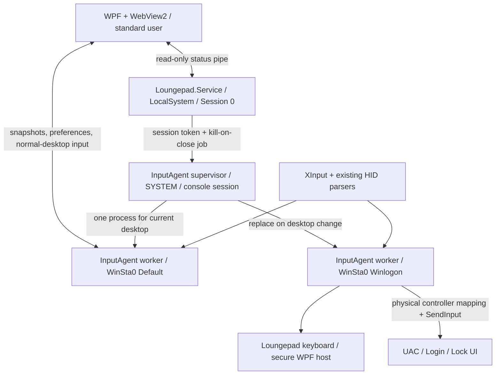

# Controller input on UAC and sign-in screens

This optional component captures controllers and emulates input outside the launcher when
enabled. WPF/WebView2 continues to run as the ordinary user. Portable installs retain local
input when the service is absent or disabled.



## Projects and lifecycle

`Loungepad.Input` shares existing XInput/HID code, bounded IPC and input preferences.
`Loungepad.Service` is a standard `ServiceBase` Windows Service. It watches
`WTSGetActiveConsoleSessionId` every 500 ms, duplicates its own SYSTEM primary token, assigns
`TokenSessionId`, and starts the supervisor using `CreateProcessAsUser`. Session 0 never accesses
the interactive desktop. No other process's token is copied.
The duplicated token also receives `TokenUIAccess` to match the signed agent's manifest;
`CreateProcessAsUser` does not ask AppInfo to prepare it and otherwise fails with Win32 740.

`Loungepad.InputAgent` follows `OpenInputDesktop` in the physical console session. Every desktop
gets a fresh process bound by `STARTUPINFO.lpDesktop` before CLR/COM initialization. The STA
worker verifies that binding with `GetThreadDesktop`; it must not call `SetThreadDesktop` after
STA initialization, which can fail with `ERROR_BUSY` (170). Existing WPF windows,
render resources and hooks cannot be moved between desktops. The service owns a job with
`JOB_OBJECT_LIMIT_KILL_ON_JOB_CLOSE`; stopping, disabling, crashing, or changing console session
terminates the entire supervisor/worker tree.
Worker failures back off from two seconds to thirty seconds, reset on desktop changes, and
retain the native Windows error code. Both background launch paths use `STARTF_FORCEOFFFEEDBACK`
to avoid flashing the Windows loading cursor.

Input polling uses a process-local high-resolution waitable timer on an 8 ms schedule, with
no global timer-resolution changes or busy spinning. The worker posts one tick at a time to
its STA dispatcher. Movement uses `Stopwatch` timing rather than the coarse `TickCount64`
clock, which remains suitable for health and timeout checks. The launcher wakes its IPC
loop immediately when new synthetic input is queued.

On Default, the agent captures controllers while the launcher is connected, and the launcher's
existing policy decides what the pad does: buttons, the keyboard toggle, combos, bindings and
clicks are sent back as synthetic input for the agent to inject. **The pointer itself is moved by
the agent** on every desktop: each request carries the launcher's policy for that tick (whether
the left stick is a mouse right now and whether the right stick is a wheel), and the agent moves
the pointer from its own fresh reading, in its own 8 ms loop, with the one formula in
`StickPointer` it also uses over a UAC prompt and on the sign-in screen. Nothing about a stick
movement crosses the pipe. It used to: the launcher aimed each move at the pointer's current
position and sent it through the pipe, and a tick that read the position before the last move had
arrived aimed from a stale base and threw that move away, which came out as slow, uneven motion
on the desktop against full speed on secure screens. The agent announces this in its reply
(`PointerOwner`); an older agent never does, and the launcher then moves the pointer through the
pipe as before, so the two can be updated separately. When the launcher is closed or stops
responding, the agent resumes background mouse/keyboard mapping after a neutral controller
handoff. With the launcher closed this mapping applies across the desktop, including games;
disable the feature if background controller-to-mouse mapping is unwanted. On Winlogon, it maps
physical readings independently of the UI. No UI input pipe exists on Winlogon. Buttons and
sticks must return to neutral when a new worker starts.
XInput checks four slots. Sony, Switch and generic HID controllers use the existing parsers
and direct HID reads, with hotplug enumeration every second. Direct reads avoid Raw Input
registrations continuously waking the display. No ViGEmBus driver, credential
provider, automatic sign-in, or changes to Windows' secure-desktop policies are required.

## Settings and selected keyboard

Enable **Controller on UAC and sign-in screens** in **Settings → General → Startup & lock screen**.
If the service is missing, Loungepad first asks whether to install it. **Install and enable**
downloads the signed service package matching the launcher's version from its GitHub release,
checks the SHA-256 digest, and asks for Windows administrator approval. Download progress and
installation status appear in the settings row. Cancelling either confirmation leaves the
feature off. No manual script is needed for ordinary users.

The elevated installer code is embedded inside the signed launcher; a downloaded script is
never executed. It verifies trusted executable signatures, a signed package catalog, and a
publisher matching the launcher before registering anything. The package is copied to a
protected staging directory and verified again before use. Missing release assets, download
errors or invalid packages leave a retryable error instead of enabling the feature.

Disabling the toggle keeps the service installed. **Uninstall Loungepad input service** appears
only while Windows reports the service installed, including when it is stopped. It asks for
confirmation and administrator approval, then removes the service, its protected files/backups
and machine input settings. The launcher, library and ordinary user preferences are retained.
Enabling again offers a fresh installation. This machine-wide flag persists across reboot and
defaults to **off** on manual installation. Closing Loungepad does not disable it.

The authenticated console user updates a validated profile through the normal-desktop pipe:
mouse enable state, sensitivity, deadzone, acceleration, boost/click mappings, touchpad preferences,
keyboard selection/toggle/size/key blocks, repeat timing and display. No credentials, executable
paths, commands or URLs are included. The elevated helper also saves this profile when toggling.
It lives in `HKLM\SOFTWARE\Loungepad\Input`.

**Before login, the latest console profile applies to this PC**, since Windows has not identified
a user. After login, the running user's Loungepad preferences replace it. Changes made while
disabled are copied when enabled again. Resetting ordinary settings does not change the
administrator-controlled machine flag.

- **Builtin (default):** uses the same `KeyboardWindow.xaml`, layout and controller controls
  in a separate non-activating WPF window on Winlogon. D-pad navigates, A selects, B closes,
  X backspaces, Y inserts space, shoulders move the caret, LS shifts, LT changes symbols and
  Menu commits. Stick/touchpad pointer input can click credential fields while it is open.
  Secure mode disables word predictions, typed-text history and punctuation replacement.
  Characters are sent exactly as selected and never logged, sent over IPC or persisted.
- **Osk / TabTip:** requests the configured Windows keyboard using its fixed installation path.
  Windows controls its desktop placement and activation; TabTip may broker UI outside the
  requesting desktop on some builds. Validate these choices on the target OS. They are not
  silently replaced if Windows refuses them. Builtin provides the self-contained keyboard host.

The configured keyboard-toggle preference applies too; Off disables controller keyboard opening.
This does not synthesize Ctrl+Alt+Delete (the secure attention sequence), handle BitLocker/pre-boot
screens, or target RDP sessions. Windows/device policy can still deny capture or injection.

## IPC and privileged installation

Messages use versioned, length-prefixed JSON, capped at 32 KiB and 128 input events per request.
Settings are range/enum checked. Queues are bounded, requests time out, and disconnects release
injected keys/buttons. Commands are checked on the desktop thread immediately before injection.
The UI stops launcher actions while it cannot access the input desktop and falls back to local
input if the service becomes unavailable.

The status pipe is read-only. The input pipe allows SYSTEM and the console user's SID, denies
network logons, and verifies the client's process session and impersonated identity. The UI
checks that the server pipe owner is SYSTEM. IPC cannot enable the service or choose executables.
The `uiAccess="true"` manifest belongs to InputAgent; WebView2 retains `uiAccess="false"`.
UIAccess alone does not switch sessions/desktops. Keep Windows' signature/path checks enabled.

Build with .NET 8 on Windows:

```powershell
dotnet build Loungepad.sln -c Release
dotnet run --project tests/Loungepad.Input.Tests
node tests/input-service-ui.test.cjs
.\tools\package-input-service.ps1
```

Packaging publishes self-contained **win-x64** service/agent files separately from the portable
launcher. Configure the existing `tools/signing.json` (see `signing.example.json`), install the
`ArtifactSigning` PowerShell module, and authenticate to your signing account first. Unsigned
executable dependencies and a SHA-256 catalog covering the package are signed through Azure
Artifact Signing. Certificates must chain to a root trusted by the target PC. Never disable
Windows' UIAccess checks. `-NoSign` creates an inspection build that the installer rejects.

Extract `dist\Loungepad.InputService-v<version>-x64.zip`. In **administrator PowerShell**, run:

```powershell
.\install-input-service.ps1 -SourcePath .
```

If manual execution reports **running scripts is disabled** (or blocks an unsigned downloaded
script), open administrator PowerShell in the extracted package folder and use:

```powershell
powershell.exe -NoProfile -ExecutionPolicy Bypass -File .\install-input-service.ps1 -SourcePath .
```

This applies only to that child PowerShell process; it does not change the PC's persistent
execution policy. The installer still verifies package signatures/catalogs and requires
administrator approval. Organization-managed policy can override process settings.
The in-app General settings installer uses bundled code passed as a command, rather than
loading a downloaded `.ps1` file, and does not need this manual workaround. App-control or
organization restrictions may still prevent setup.

The script verifies signing/catalog hashes, installs under `%ProgramFiles%\Loungepad\Input`,
secures directory permissions, registers automatic LocalSystem startup and configures recovery.
The equivalent registration commands are:

```powershell
sc.exe create Loungepad.Service binPath= '"C:\Program Files\Loungepad\Input\Loungepad.Service.exe"' start= auto obj= LocalSystem
sc.exe start Loungepad.Service
```

Use the installer for actual installation; registration alone does not verify signing or protect
files. Do not select **Allow service to interact with desktop**. Start Loungepad normally and
enable the feature in Settings. Run the installer from a newly signed package to update.
The launcher's portable auto-updater does not replace SYSTEM binaries. First-time service
installation is handled by the General settings flow after user confirmation; subsequent
service updates currently use the signed package installer.

For a release, publish the usual signed `Loungepad.exe` and
`Loungepad-v<version>-win-x64.zip` launcher assets, plus the optional signed
`Loungepad.InputService-v<version>-x64.zip`. The service ZIP deliberately does not end in
`-win-x64.zip`: older launcher updaters select assets by that suffix.
The release tag and launcher file version must agree and be newer than the installed version.
Development builds do not auto-update, and prereleases are not selected by the latest-release
endpoint. Existing users receive the launcher and new setting through the normal updater; they
enable the General setting and confirm service installation with administrator approval. Future
service updates use the same installer from the new signed package; it stops/replaces/restarts
the service and preserves the existing enabled flag and profile.

```powershell
.\uninstall-input-service.ps1
```

Uninstall stops the process tree, removes SCM registration, protected service files/backups and
the machine input registry key. `sc.exe stop Loungepad.Service` is an immediate administrator stop.

## Verification and release limits

Automated checks cover IPC framing, controller/touchpad serialization, invalid settings/input,
rejection of user-owned spoof pipes, exact secure-keyboard character output, download/version/hash
validation, ZIP path/link/duplicate rejection, and the install/uninstall UI flow. They do not prove
secure-desktop behavior on a physical Windows machine.

Before release, test a **signed installed build** with Xbox, Sony USB/Bluetooth, Switch and generic
HID pads. Cover launcher navigation, game focus suppression, touchpad drag, rest/wake, hotplug,
UAC consent/credential prompts, lock/unlock, cold boot before login, fast user switching, selected
keyboard/symbol input, service disable/stop/crash and repeated desktop transitions. A held button
must not approve a prompt or type after a transition. Validate Osk and TabTip separately.
Inspect the in-app service status and generic `LastError` value; a running process does not prove
successful input. Automated checks never need secure-screen credentials.
`AgentHealth` records only the responding worker's process/session/desktop, mapping owner,
controller presence and neutral-gate readiness. It contains no controller reports or typed text.
The service status waits for this heartbeat instead of treating a spawned supervisor as success.

For the STA desktop startup regression, run:

```powershell
dotnet run --project tests/Loungepad.Input.Tests -- --desktop-probe
```

The default test suite never injects real input. A separate, explicit integration check validates
the installed SYSTEM pipe, observes real pointer movement, restores the pointer, then checks
worker stability after disconnecting. Close the launcher first so its IPC client does not occupy
the single input connection; connect a controller and leave all its controls neutral.

```powershell
dotnet run --project tests/Loungepad.Input.Tests -- --service-mouse-probe
# Require Task Manager to be foreground during the movement check:
dotnet run --project tests/Loungepad.Input.Tests -- --service-mouse-probe Taskmgr
```

This opt-in test moves the real pointer twelve pixels and restores it, with no clicks or keys.
It applies to the Default desktop only. A healthy Winlogon heartbeat during a UAC/lock transition
verifies worker startup and controller detection, but physical mapping and keyboard behavior on
those screens still require the signed installed build to be exercised with a controller.

Read-only hardware/timer measurements are available with `--input-timing-probe`. This compares
controller reads, device discovery, ordinary waits and the precise input timer. It briefly
requests and restores a 1 ms timer resolution only in the benchmark process for comparison;
the launcher and service use their own high-resolution waitable timers instead.

`--hid-probe` reads the controllers through a reader of its own for three seconds and prints each
instance the reader holds (name, transport, serial, whether it is shadowed), how often "the last
pad to report" changed, and each instance's report rate. A DualSense plugged in while it is paired
is on the cable and on Bluetooth at once, and Windows lists it twice; the reader shadows the
Bluetooth instance while a wired instance of the same pad is present (same vendor and product, not
two different serials), so one physical pad is one reading. Read as two, the stick alternated
between the cable's copy and the radio's lagging one a few hundred times a second, and every push
came out as a sawtooth. `--dispatcher-cadence-probe` reproduces the worker's tick mechanism and
measures the spacing of ticks on the dispatcher. `--pointer-trace <seconds> [wait]` records every
change of the real pointer's position at about 1 ms and describes each run of motion (spacing of
moves, size of steps); move only the controller stick while it runs, and with `wait` it starts
recording at the first movement. None of the three injects input. Two more do move the real
pointer, with no clicks or keys: `--pointer-sweep` drives it from the shared stick mover at the
agent's 8 ms cadence through the absolute move the agent sends, a relative move and SetCursorPos,
and compares the spacing and the size of the steps each produced; `--absolute-mapping-probe`
sends one absolute move per column and per row with candidate formulas and counts the ones that
landed on the wrong pixel. Windows floors `n * width / 65536`, and the formula that lands every
pixel is `(x * 65536 + 32768) / width`; the old one missed nearly half the columns.

`--navigation-hook-stall-probe` is the check for the navigation filter's thread. It is opt-in
because it injects one inert gamepad virtual key (`VK_GAMEPAD_RIGHT_THUMBSTICK_LEFT`, 0xDA) a few
times: it installs the filter, blocks the probe's own dispatcher thread for 1.5 s with a key sent
in the middle of the stall, and checks that every key was still suppressed; it then puts a plain
hook on the stalled thread itself and reports what Windows did with it. With the service installed
and enabled, its worker's hook drops whatever the probe's hooks let through.

To check that an installed worker's hook is alive without touching a controller, read
`SuppressedNavigationEvents` from the `AgentHealth` value, inject that same key once (down and up)
with `SendInput` from an ordinary process while something inert is in the foreground, wait two
seconds for the next heartbeat and read it again: a live hook on that desktop counts two. This
proves the hook sees and drops injected gamepad virtual keys; it does not prove where Windows'
own controller navigation events travel on every screen.

## Windows controller navigation conflicts

Windows can independently map a stick to focus navigation and A/Cross to activation, producing
both a mouse click from Loungepad and activation of the highlighted control. Each enabled desktop
worker installs a low-level hook that consumes only `VK_GAMEPAD_*` (0xC3-0xDA) while mouse mapping
is on. Ordinary keyboard keys, including Tab, Enter, arrows and credential characters, pass
through unchanged. Direct XInput/HID/GameInput readings are not blocked. Stopping the worker
removes the hook. `SuppressedNavigationEvents` is an aggregate count, without key contents.

The hook lives on a thread of its own that only pumps messages for it. A low-level hook is called
on the thread that installed it, within Windows' `LowLevelHooksTimeout`; a thread that does not
answer in time is skipped for that key, and Windows documents that it may then remove the hook
silently. The worker's dispatcher thread shows the secure keyboard, a WPF window whose first show
takes that long, so the hook could not share it. Measured on Windows 11 26200 with the stall
probe above: a hook on a thread blocked for 1.5 s survived but missed the keys sent during the
stall, which Windows navigation would then have acted on; the filter on its own thread caught
every one.

Microsoft also described
a machine-wide opt-out at
`HKLM\SOFTWARE\Microsoft\Input\Settings\ControllerProcessor\ControllerToVKMapping`, DWORD
`Enabled = 0`. Setting it requires administrator rights. It affects Windows controller-to-key
navigation, including other Windows apps; it is separate from Loungepad's service toggle and
does not disable controller drivers or the GameInput service. Record the previous value before
changing it, and restore that value (or remove `Enabled` if it was absent) to undo the change.

This is not automatically applied by the installer. Its behavior must be tested on the target
Windows build: [Microsoft's tracker includes a reported regression](https://github.com/microsoft/microsoft-ui-xaml/issues/10035).
Steam desktop mappings or other controller mappers can also emit extra input independently.

Also cover installation from General settings (requires the service ZIP published on the matching
release), declining installation, cancelling UAC, interrupted downloads, stopped-service detection,
disable/re-enable without reinstalling, clean uninstall, and reinstall. Setup tests must use a signed
launcher: unsigned debug builds deliberately cannot authenticate a publisher for automatic install.

## Windows references

- [Session 0 and interactive services](https://learn.microsoft.com/en-us/windows/win32/services/interactive-services)
- [Desktops and Winlogon access](https://learn.microsoft.com/en-us/windows/win32/winstation/desktops)
- [SetThreadDesktop restrictions](https://learn.microsoft.com/en-us/windows/win32/api/winuser/nf-winuser-setthreaddesktop)
- [CreateProcessAsUser](https://learn.microsoft.com/en-us/windows/win32/api/processthreadsapi/nf-processthreadsapi-createprocessasuserw)
- [UIAccess signing and installation](https://learn.microsoft.com/en-us/windows/win32/winauto/uiauto-securityoverview)
- [Catalog verification](https://learn.microsoft.com/en-us/powershell/module/microsoft.powershell.security/test-filecatalog)
